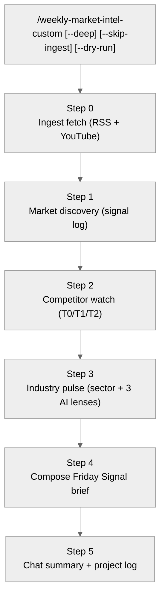

# Weekly Market Intel (custom)

**What this skill does.** One command runs the full weekly outside-in research pass: ingest fetch → market signal log → competitor watch → industry pulse → Friday Signal brief. Produces the **steerco-facing advisory brief** that grounds product, sales, and exec decisions in the week's outside-in reality.

**Cadence:** weekly, default Friday. **NOT part of the idea→PRD pipeline.** Standalone. Downstream skills (`/initiative-discovery-custom`) consume the brief; they do not invoke this skill.

**`-custom` suffix** keeps it protected from `/dex-update` overwrites.

**Default budget:** 45–60 min end-to-end (ingest + synthesis + brief).

**Flags:**
- `--deep` — monthly mode; re-reads sector PDFs in Step 3 and writes a monthly industry-pulse digest. Default: first Friday of the month.
- `--skip-ingest` — debug; skip Step 0 and use whatever is already in `06-Resources/Market_intelligence/ingest/`.
- `--dry-run` — compose the Friday Signal to chat only; no file writes.

**Operating doc:** [`plans/Research/felix-strategy.md`](../../../plans/Research/felix-strategy.md). *(Filename retained for historical traceability; this skill is the formal renaming.)*

---

## Loop integration

This skill is **NOT in the idea→discovery→PRD pipeline.** It runs on its own weekly cadence. The pipeline relationship is one-way:

- **Upstream:** none — this skill is the source.
- **Downstream consumer:** [`/initiative-discovery-custom`](../initiative-discovery-custom/SKILL.md) reads the latest Friday Signal during its Phase 0 (staleness check) and Phase 3 (market signal alignment). If the brief is >7 days stale, the discovery skill warns and asks the user to run this skill.

The pipeline does NOT auto-trigger this skill. Running this is a deliberate weekly ritual.

---

## Consolidation model (source of truth)

**One weekly Steerco run of record.** Do not split this across legacy slash-commands.

| Role | Skill / artefact | Notes |
|------|------------------|--------|
| **Weekly outside-in umbrella** | `/weekly-market-intel-custom` (this skill) | Single invocation; Steps 0–5 in this doc. |
| **First-party book-of-business** | [`/felix-client-signals-custom`](../felix-client-signals-custom/SKILL.md) | **Separate** skill, on-demand. Writes `Wyzetalk_Clients/*_signals.md`; **never** merged into the Friday Signal body (CPO-internal). |
| **Signal-log only (subset)** | [`/weekly-market-discovery`](../../../.agents/skills/weekly-market-discovery/SKILL.md) | Step 1–equivalent; use if you truly need **only** `Market_and_deal_signals.md` rows. Prefer this skill on Fridays so competitor + industry + brief stay aligned. |
| **Downstream consumer** | [`/initiative-discovery-custom`](../initiative-discovery-custom/SKILL.md) | Reads the latest `synthesis/weekly/<ISO-Monday>_friday_signal.md`; if **mtime > 7d**, treats as stale and asks user to re-run this skill. |

**Markers on disk (for downstream skills):** the Friday Signal path + refreshed `Competitors/profiles/*.md` + new Phase 1 rows in `Market_and_deal_signals.md` are the contracts; no separate `*_weekly_brief.md` filename.

---

## Posture (must read before running)

This is a **steerco-facing advisory agent**. The CEO may escalate the output to board. That constraint governs voice, scope, and exclusions:

- **Advisory voice throughout** — *what we see / what it means for WT / what we propose.* Never risk-alarm vocabulary ("at risk", "threatens", "crisis", "panic", "losing").
- **Meta-principle:** the weekly brief advising the CPO is the prototype of what **WT-the-product** aspires to offer its clients (see [`System/icp.md`](../../../System/icp.md) — advisor-platform thesis). If the brief ever stops feeling like advisor-voice, the skill is broken.
- **Tone test before any item lands in the brief:** *"If this landed in a board pack with no other context, would it create clarity or panic?"* If panic, reframe or drop.

### Hard exclusions

- **No client-activity data surfaced.** The book-of-business snapshot ([`05-Areas/Companies/Wyzetalk_Clients/index.md`](../../../05-Areas/Companies/Wyzetalk_Clients/index.md)) is CPO-internal, `visibility: cpo-internal`, `dashboard_surface: false`. Never cite numbers or account names from it on the brief. Client-signal work is owned by [`/felix-client-signals-custom`](../felix-client-signals-custom/SKILL.md) — separate skill, separate cadence.
- **No individual-account risk callouts.** Account names appear in the brief only in neutral reference contexts (case-study candidates, ICP illustration), never in risk framing.
- **Yoobic does not recur** on the brief. T2 adjacent-market (retail task-mgmt / visual floor-ops) per `System/icp.md`. Appears only if a move materially crosses WT's ICP segments (Mining, FMCG, Auto & Industrial).
- **JEM HR is T0 — strategic-frame watch, not feature-feature.** Platform bundle: device + telco + EWA + payslip. Every T0 move is framed against WT's counter-thesis (the advisor-platform; win the *employer's insight*, not the *worker's wallet*).
- **Three sharpened AI sub-lenses, not generic "AI".** Frontline-AI product moves / worker-data regulation / union-AI sentiment. Exactly three bullets per week; "no movement worth a line this week" is a valid complete answer for any lens — do not pad.
- **One page target for the brief.** If running long, tighten observations rather than cutting proposals.

---

## Run sequence — 6 steps, in order



### Step 0 — Ingest fetch (inline; no cron dependency)

Goal: make sure Layer 1 has this week's content before any synthesis. The skill runs the fetchers itself.

**Skip if:** `--skip-ingest` flag is set.

**Freshness short-circuit:** if the newest file under `06-Resources/Market_intelligence/ingest/newsletters/**/*.md` has an mtime within **24 hours**, skip the fetch and note `"Step 0 — ingest fresh (<N> hours), reusing"` in the chat-side summary. This keeps same-day re-runs cheap.

**Otherwise run both, each wrapped defensively:**

```bash
bash .scripts/market-intelligence/run-weekly-intel-fetch.sh --since-days 8 --verbose
bash .scripts/market-intelligence/run-transcript-queue.sh
```

**Failure policy (critical):** if any Step 0 command errors (missing venv, TLS, empty queue, script absent), **log a one-line note** into the brief's provenance (e.g. *"Ingest fetch failed on RSS; operating on vault as of last successful fetch <date>"*) and **continue to Step 1**. Step 0 must never block the brief.

**Do not stack** `/intelligence-scanning` or `/weekly-exec-intel` in the same session — they re-read the same `ingest/` for overlapping summaries. This skill is the single run of record.

### Step 1 — Market discovery (signal log)

Goal: capture the week's notable items as Phase 1 rows in [`06-Resources/Market_and_deal_signals.md`](../../../06-Resources/Market_and_deal_signals.md).

1. Read [`Market_and_deal_signals.md`](../../../06-Resources/Market_and_deal_signals.md) § **Weekly routine** — Mon–Fri focus by day:
   - **Mon:** Competitor moves (product / pricing / partnerships)
   - **Tue:** Funding, M&A, category rounds
   - **Wed:** Workforce / HR-tech narrative (deskless, TA, AI)
   - **Thu:** Africa / SA regional — payroll, labour, channels
   - **Fri:** Synthesis — gaps, log hygiene, promote to `EV-*`
2. Walk this week's ingest under `ingest/newsletters/<slug>/` and `ingest/youtube/<slug>/` (last 7 days — use file mtimes). Slug-to-theme map in [`06-Resources/Market_intelligence/ingest/README.md`](../../../06-Resources/Market_intelligence/ingest/README.md) and [`sources_manifest.yaml`](../../../06-Resources/Market_intelligence/sources_manifest.yaml).
3. For each notable item, **append a row** to § **Phase 1 — Signal log** in `Market_and_deal_signals.md`:

   ```
   | <Mon date of ISO week> | <Day> | [<source title>](<url>) | <theme> | <WT implication> |
   ```

4. If material to product decisions, **propose** (do not auto-write) an `EV-*` row for [`06-Resources/Market_and_competitive_signals.md`](../../../06-Resources/Market_and_competitive_signals.md). Collect for the brief's "EV candidates queued" section in Step 4.

**Capture for Step 4:** count of new Phase 1 rows, count of proposed EV candidates, and the 3 most interesting rows with one-line WT-implication each.

### Step 2 — Competitor watch (T0 / T1 / T2)

Tiering source-of-truth: [`System/icp.md`](../../../System/icp.md) § Known near-neighbours.

#### T0 — JEM HR (every run, deep — distinctive method)

Beyond a standard site / LinkedIn / press pass, **explicitly scan for bundle-extension moves**:

- **Device / telco:** new carrier partnership, subsidised-device deal, MVNO licence expansion, new geographic rollout.
- **Financial-services / EWA:** new payroll integration, new employer on SmartWage, pricing/fee change, new EWA geography, regulatory filing.
- **Payslip / HR-data:** integration with new HRIS/payroll vendor, data-sharing partnership, employer-side analytics product.
- **Platform-layer:** new app-store feature, new employer-side dashboard capability, AI feature tied to any of the above.

For each T0 move capture two things:

1. **The move** (what, when, source URL).
2. **Strategic implication for WT** — does it tighten JEM's worker-side bundle? does it open an employer-side gap WT should step into? This framing is what the brief uses.

Update [`06-Resources/Competitors/profiles/Jem.md`](../../../06-Resources/Competitors/profiles/Jem.md):

- Bump `last_reviewed: <today>` in frontmatter.
- Append a dated bullet under `## Watch signals` with move + source + WT-implication.
- If the platform shape shifted materially, add/update a "platform-snapshot" block with today's date.

**"Zero bundle-extension moves detected this week" is a valid, complete T0 output** — the T0 section of the brief still renders, just states so.

#### T1 — Feature-comparable incumbents (weekly scan)

Watch list: **Staffbase, Workvivo (Zoom), Beekeeper, Speakap, Blink, Flip**.

For each:

1. **Website diff** — Scrapling MCP: `scrapling_get` first → `scrapling_stealthy_fetch` if blocked. Compare against the profile's last-reviewed snapshot. Look for: new product pages, pricing, case studies, leadership changes.
2. **LinkedIn pulse** — last 7 days on the company handle (`scrapling_stealthy_fetch` on company URL). Product launches, partnerships, funding posts.
3. **Press search** — scan `06-Resources/Market_intelligence/ingest/newsletters/*` last 7 days for the name. HR Tech Feed and UNLEASH are the highest-hit sources.
4. **Compare to 2024 baseline** — [`06-Resources/Competitors/_imports/Competitor_2024_baseline.xlsx`](../../../06-Resources/Competitors/_imports/Competitor_2024_baseline.xlsx). **Drift** ("added X since 2024") beats a static feature list.

Update `profiles/<Name>.md` same pattern as T0, scaled down. Only T1s that **actually moved** appear in the brief.

#### T2 — Adjacent / rotation (on-surface only)

- **Yoobic** — retail task-mgmt adjacent market. **Not** a recurring Friday entry. Include only if an ingest-surfaced move materially crosses WT's ICP segments.
- **Rotation list:** Appspace, Firstup, Humand, LumApps, Poppulo, Unily, Sentiv, Teamwire, PayMeNow, Oneteam. Pick 2–3 per quarter for deeper passes; log which got covered.

If a T2 surfaces in this week's ingest, promote temporarily into the scan for that run.

#### Material vs noise

**Material (always raise):** new product launch / SKU, pricing change, M&A, funding round, **any T0 bundle-extension move**, named partnership with payroll / HRIS / device / telco vendor, public entry into a WT ICP segment by a T1/T2.

**Noise (don't raise unless asked):** generic blog posts, conference attendance, junior hires, site redesigns without feature/positioning change.

**Capture for Step 4:**

```
T0 — JEM HR:
- <move> → <what-it-means-for-WT-advisor-platform>
(or: "No bundle-extension moves detected this week.")

T1 — Notable moves:
- <competitor>: <move> → <WT implication>
(omit entirely if no movers)

T2 surfaces (only if material):
- <competitor>: <move>
```

Also refresh [`06-Resources/Competitors/COMPETITOR_INDEX.md`](../../../06-Resources/Competitors/COMPETITOR_INDEX.md) if it exists — bump the "last weekly pass" column.

### Step 3 — Industry pulse (sector rotation + three AI sub-lenses)

Two passes — Pass A is rotating, Pass B runs every week.

#### Pass A — Rotating sector pulse (~5 min)

Goal: tie the week's ingest back to industry context for **one sector** (rotate weekly).

1. Pick this Friday's sector (rotation: Mining → Energy → Retail → Manufacturing → Healthcare → Transport → Global-frontline → repeat).
2. Read the sector folder's table of contents in `06-Resources/Research/Industry_reports/<sector>/`.
3. Cross-reference: what items in this week's `Market_intelligence/ingest/*` (last 7 days) connect back to a known truth from a sector PDF?
4. **Output for Step 4:** one paragraph — "this week's `<sector>` signal in industry-truths context" — plus which ICP segment and which PRD it touches.

Sector → ICP + watchpoint:

| Sector | Folder | ICP tie | Watchpoint |
|---|---|---|---|
| Mining & metals | `Mining_and_metals/` | ICP 2 | Highest WT customer concentration; MHSA / ICMM / CSRD |
| Energy | `Energy/` | ICP 2⊕ | Sasol, Natref — adjacent to Mining; safety-driven |
| Retail | `Retail/` | (v2 candidate) | Largest frontline populations; audit + recall pressure |
| Manufacturing | `Manufacturing/` | ICP 1 (FMCG) / ICP 3 (heavy) | FSSC / BRCGS / B-BBEE; shift-based |
| Healthcare | `Healthcare/` | (opportunity) | Limited current footprint |
| Transportation & logistics | `Transportation_and_logistics/` | ICP 3⊕ | RCL, Bidvest |
| Global frontline | `Global_frontline/` | Cross-cutting | UKG, Microsoft, Schoox — durable category truths |

#### Pass B — AI / software trends (every week, exactly three sub-lenses)

Three bullets, one per lens. No more, no fewer. "No movement worth a line this week" is a valid complete entry for any lens — do not pad.

| Sub-lens | What to scan for | Primary sources |
|---|---|---|
| **(i) Frontline-AI product moves** | AI features shipping in JEM HR, Beekeeper, Staffbase, Workvivo, Speakap, Blink, Flip — and any adjacent frontline-EX vendor. Emphasis on **employer-side** features (analytics, recommendations, workforce advisory), not consumer chatbots — that's WT's lane per `System/icp.md`. | HR Tech Feed, UNLEASH, competitor LinkedIn, competitor release notes |
| **(ii) Worker-data regulation shifts** | **POPIA** (SA) enforcement / guidance. **EU AI Act** / **CSRD** on workforce data. Sector-specific: MHSA amendments, FSSC data handling, ICMM disclosure. | Webber Wentzel, ENSafrica, Cliffe Dekker Hofmeyr briefings; EU AI Board; mining / food-safety regulators |
| **(iii) Union / worker-side AI sentiment** | SA union posture on AI monitoring, worker-surveillance, EWA, and algorithmic decision-making. NUMSA, Amcu, Cosatu, Solidarity. | Daily Maverick, Business Day, union press releases, Engineering News |

**Output framing for Step 4:** every AI sub-lens line is framed as *"what we see → what it means for WT"* in advisory tone.

#### `--deep` (monthly — first Friday, adds ~30 min)

In addition to Pass A + Pass B:

1. Re-read the most-cited 2–3 PDFs per sector (priority: <18 months old; flag >24 months for replacement).
2. Extract **time-horizoned beliefs** (Today / 6 months / 12 months).
3. Diff against existing [`04-Projects/Product_Strategy/Industry_Truths.md`](../../../04-Projects/Product_Strategy/Industry_Truths.md) if it exists; **propose updates only** — never auto-write.
4. Write the monthly digest to `06-Resources/Market_intelligence/synthesis/monthly/<YYYY-MM>_industry_pulse.md`.

**Cross-cutting PDFs read on every `--deep`:**

- `Standalone_checklists/Frontline-Learning-Technology-Capability-Checklist_v2-1.pdf`
- `Standalone_checklists/aon-global-risk-management-survey-key-findings-2023.pdf`
- `Standalone_checklists/the-elastic-supply-chain.pdf`
- `Global_frontline/The State of Frontline Training & Tech 2025 Report.pdf`
- `Global_frontline/MC049-UKG-FrontlineWorkforceGlobalStudyReport_UKI.pdf`

**Capture for Step 4:** one sector paragraph + three AI sub-lens lines + (if `--deep`) proposed Industry_Truths diffs.

### Step 4 — Compose the Friday Signal brief

**Output file:** `06-Resources/Market_intelligence/synthesis/weekly/<YYYY-MM-DD>_friday_signal.md` where `<YYYY-MM-DD>` is the **Monday** of this ISO week.

**Skip file write if `--dry-run`** — render to chat only.

#### Frontmatter (exact)

```yaml
---
slug: friday_signal_<YYYY-MM-DD>
type: weekly_signal_brief
audience: steerco
tone: advisory
authored_by: weekly-market-intel-custom
icp_version: <read the Version line from System/icp.md>
---
```

#### Template (hard structure — follow exactly)

```markdown
# WT Friday Signal — <Monday-of-week date>

**Reader:** Steerco. CEO decides on board escalation.
**Authored:** Weekly market intel.
**This week in one line:** <the single most important observation — plain-English>

---

## Top of mind

*(The one thing that moved strategic ground this week. Often — not always — JEM HR platform-bundle territory. If nothing moved, say so: "This week the strategic frame held.")*

**What we see.** <1–3 sentences. Factual. No interpretation yet.>

**What it means for WT.** <1–3 sentences. Connect to the WT advisor-platform thesis (`System/icp.md`).>

**What we propose.** <1–3 sentences. A posture, not an order.>

---

## Competitor moves

### T0 — JEM HR platform watch

*(Always this section; "no bundle-extension moves detected this week" is a valid complete entry.)*

**What we see.** <bulleted list of T0 moves, or explicit "no moves detected">

**What it means.** <one short paragraph — connect to WT advisor-platform counter-posture>

**What we propose.** <one short paragraph — posture / hold-the-line / worth-testing>

### T1 — Feature-comparable incumbents (this week's movers only)

*(Omit the block entirely if nothing material.)*

- **<Competitor>:** <1-line observation> → <WT implication>

### T2 — Adjacent / rotation

*(Include only if a T2 surfaced with a move materially crossing WT's ICP segments.)*

---

## Industry signal — <rotating sector this week>

**What we see.** <one paragraph of sector-specific signal + tie-back to sector industry-research PDF>

**What it means for WT.** <one paragraph — which ICP segment, which PRD>

**What we propose.** <one paragraph — posture / discovery hypothesis / ICP-calibration note>

---

## AI & software trends (three sub-lenses)

*(Exactly three bullets — one per lens. If a lens has nothing, write "no movement worth a line this week" explicitly — do not skip the lens.)*

**(i) Frontline-AI product moves.** <one-line observation → WT implication>

**(ii) Worker-data regulation shifts.** <one-line observation → WT implication>

**(iii) Union / worker-side AI sentiment.** <one-line observation → WT implication>

**What we propose (combined AI read).** <one short paragraph — how this week's AI picture should shape WT's advisor-platform messaging and product decisions>

---

## Worth a click

*(3 headlines, no commentary.)*

- [<headline>](<url>) — <source, date>
- [<headline>](<url>) — <source, date>
- [<headline>](<url>) — <source, date>

---

## What this week's discovery cards should know

*(Only if there are active initiatives in `discovery` with cards that consume this brief. Omit section if none.)*

- **<Card title>** — <one-line "here's what shifted this week that's relevant">

---

## EV candidates queued

*(Items proposed for promotion to `Market_and_competitive_signals.md` as `EV-*` rows. Neutral phrasing; CPO confirms and assigns IDs.)*

- **<1-line summary>** — source: <where it came from>; binds to: <PRD / ICP segment / roadmap item>

---

## Provenance

- **Ingest status:** <"fresh (<N>h)" | "fetched this run" | "fetch failed; using vault as of <date>">
- **Signal-log rows added this week:** <N>
- **Competitor profiles refreshed:** <comma-separated names>
- **Industry-pulse mode:** `weekly (default)` | `--deep` (first Friday of month, or when flag passed)

---

*Weekly market intel, week of <date>. Advisory. Safe for board escalation at CEO's discretion.*
```

#### Voice guide (enforce during composition)

**Do:** "We see…" / "What it means is…" / "We propose considering…"; name observations plainly ("moved", "announced", "shipped" — not "aggressive", "worrying", "bold"); anchor every "what we propose" to the WT thesis in `System/icp.md`.

**Don't:** risk / threat / alarm vocabulary ("at risk", "threatens", "alarming", "panic", "crisis"); individual account names in any risk framing; "churn", "lost", "losing", "attrition" in connection with specific WT accounts; superlatives without citation; any content sourced from `Wyzetalk_Clients/index.md` (hard-excluded).

### Step 5 — Chat summary + project log

After the brief is written, present in chat — **terse, briefing-room, advisory, no preamble**:

```
Friday brief, week of <Mon date>, filed at <path>.

- <one-line T0 summary: JEM platform-move status this week>
- <one-line "what we propose WT consider" (the advisor-voice anchor)>
- EV candidates queued: <N>  (promote via manual edit to Market_and_competitive_signals.md)
```

If you maintain a project orchestration log (e.g. `04-Projects/<project>/<orchestration>.md`) with a Slice log section, append a one-liner:

```
- YYYY-MM-DD (Fri) — Weekly intel run: <N> signal-log rows, <N> EV candidates, JEM status: <moved|quiet>. Brief: synthesis/weekly/YYYY-MM-DD_friday_signal.md
```

---

## Cadence

- **Default:** Fridays, one run per week.
- **Monthly:** first Friday uses `--deep` (PDF re-read + `synthesis/monthly/<YYYY-MM>_industry_pulse.md`).
- **Quarterly:** pair with the **competitor profile deep refresh** ritual + source-list audit (`Source_Guide_v2_1.md` vs `intel_feeds.json` drift check). See [`plans/Research/felix-strategy.md`](../../../plans/Research/felix-strategy.md) § Cadence.
- **Discovery-skill bridge:** This skill runs Friday → [`/initiative-discovery-custom`](../initiative-discovery-custom/SKILL.md) reads the brief from any subsequent invocation. If the latest `*_friday_signal.md` is **>7 days** old, the discovery skill warns the user and asks them to run this skill before continuing.

---

## What this skill does NOT do

- **Does not author or change** `System/icp.md` — that's the CPO's call.
- **Does not** write to discovery packages — that's [`/initiative-discovery-custom`](../initiative-discovery-custom/SKILL.md).
- **Does not** make product decisions — only surfaces signal and proposes posture. The CPO decides.
- **Does not** run [`/felix-client-signals-custom`](../felix-client-signals-custom/SKILL.md) — that skill is on-demand, CPO-internal, and has a separate trigger.
- **Does not** call `/intelligence-scanning` or `/weekly-exec-intel` — they overlap this skill's corpus; running them in the same week is duplicate work.
- **Does not** auto-promote `EV-*` rows — proposes only, CPO assigns IDs.
- **Does not** auto-write `Industry_Truths.md` — proposes only.
- **Does not** modify the 2024 competitor baseline xlsx — that's the historical anchor.
- **Does not** participate in the idea→discovery→PRD pipeline. It's a separate, weekly cadence — the pipeline reads its output but does not invoke it.

---

## Related

- [`/initiative-discovery-custom`](../initiative-discovery-custom/SKILL.md) — downstream consumer (per-initiative discovery skill that reads this skill's Friday Signal output).
- [`/felix-client-signals-custom`](../felix-client-signals-custom/SKILL.md) — **separate skill**, CPO-internal, on-demand only (book-of-business snapshot for ICP calibration).
- [`/scrape`](../scrape/SKILL.md) — Scrapling MCP (used inline by Step 2 for competitor site diffs).
- [`/industry-truths`](../industry-truths/SKILL.md) — downstream consumer when `--deep` proposes Industry_Truths updates.
- [`06-Resources/Market_intelligence_Source_Guide.md`](../../../06-Resources/Market_intelligence_Source_Guide.md) — router: sources, feeds, manifests.
- [`06-Resources/Market_intelligence/Source_Guide_v2_1.md`](../../../06-Resources/Market_intelligence/Source_Guide_v2_1.md) — canonical 26-source list.
- [`System/icp.md`](../../../System/icp.md) — WT thesis + T0/T1/T2 tiering source-of-truth.
- [`plans/Research/felix-strategy.md`](../../../plans/Research/felix-strategy.md) — operating doc (filename historical).

---

## Acceptance checklist

Use this to sign off a run or a SKILL.md edit. **PASS** = every applicable box checked.

**Reads (skill must use before asserting signal)**

- [ ] `06-Resources/Market_intelligence/ingest/` (newsletters + youtube slugs, ~7d window)
- [ ] `06-Resources/Market_and_deal_signals.md` (§ Weekly routine + § Phase 1 — Signal log)
- [ ] [`System/icp.md`](../../../System/icp.md) (tiering, thesis, `Version` for brief frontmatter)
- [ ] `06-Resources/Research/Industry_reports/<this week's sector>/` (Step 3 Pass A)
- [ ] `06-Resources/Competitors/profiles/` + baseline xlsx as required by Step 2

**Writes (predictable artefacts)**

- [ ] `06-Resources/Market_intelligence/synthesis/weekly/<ISO-Monday>_friday_signal.md` (template + frontmatter in Step 4)
- [ ] New Phase 1 rows appended in `Market_and_deal_signals.md` (Step 1)
- [ ] T0 (`Jem.md`) and any **moved** T1 profiles updated; [`COMPETITOR_INDEX.md`](../../../06-Resources/Competitors/COMPETITOR_INDEX.md) if present
- [ ] `--deep` only: `synthesis/monthly/<YYYY-MM>_industry_pulse.md` + proposed Industry_Truths diffs in brief (never auto-write `Industry_Truths.md`)
- [ ] Chat Step 5 summary

**Explicit non-writes (out of scope for this skill)**

- [ ] Confirmed: no `05-Areas/Companies/Wyzetalk_Clients/*_signals.md` from this skill — use `/felix-client-signals-custom`
- [ ] Confirmed: no discovery packages — `/initiative-discovery-custom` owns those

**Gates**

- [ ] Empty or failed ingest: provenance states reality; skill does **not** invent URLs or moves
- [ ] Same calendar week: re-run **updates** the same `<ISO-Monday>_friday_signal.md` (idempotent filename)

**Failure modes**

- [ ] Step 0 script failure → provenance one-liner + continue (never block brief)
- [ ] Partial Step 2 (e.g. scrape blocked) → brief documents what was scanned vs skipped

**Cost / session**

- [ ] No stacked `/intelligence-scanning` or `/weekly-exec-intel` in the same session as this run (duplicate corpus)
- [ ] Default budget: ~45–60 min wall-clock; `--skip-ingest` / 24h ingest short-circuit for cheap re-runs

---

*Replaces `felix-custom` (the Felix Leiter / 007 persona-named version). Operational substance preserved; persona stripped, role described in the name. Renamed 2026-04-29; downstream references repointed from `/moneypenny-custom` (deleted-after-cleanup) to `/initiative-discovery-custom`.*
