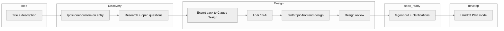

# PDLC Orchestration UI — north star & thin slices

**Owner:** Shaun  
**Goal:** A **usable orchestration UI** for Wyzetalk (Steerco, CTO, PM) over the **PDLC** with swim lanes **`idea` → `discovery` → `design` → `spec_ready` → `develop` → `uat` → `deployed`** (+ **`parked`**). **`/pdlc-brief-custom`** runs on **`idea` → `discovery`** (typed brief to schema — not full **`/product-brief`** PRD); optional **`/pdlc-idea-gate-custom`** while in **idea**; **`/agent-prd`** runs when the card is in **`spec_ready`**; handoff to **`develop`** is PRD + design for **Cursor Plan mode**. **Which skill on which move:** [plans/PDLC_UI/lifecycle-transitions.md § Skill triggers](../plans/PDLC_UI/lifecycle-transitions.md#skill-triggers-on-column-moves-pdlc-ui). Cards may **move backward** for scope change; **only `→ idea`** wipes to **title + description**. **Strategy / pillar** warnings when work is outside declared company strategy. Detail: [plans/PDLC_UI/lifecycle-transitions.md](../plans/PDLC_UI/lifecycle-transitions.md). **No big bang:** each slice is **one vibe-coding session**–sized (roughly **one page / one flow / one component tree**), demonstrable before the next slice starts.

**Primary spec corpus:** [Wyzetalk Essential PRDs](../06-Resources/PRDs/README.md#wyzetalk-essential-core-product) (flat `06-Resources/PRDs/*.md`) + [PRD_Product_Map.md](../06-Resources/PRDs/PRD_Product_Map.md). **All feature PRDs** live here long-term; **only** the spec used to **build `pdlc-ui` itself** is the short-lived bootstrap exception. **Next / roadmap** PRDs appear in a **separate lane or tab** so they never blur the Essential launch contract.

**Interim board owner:** **Shaun** — runs gates, **Cursor polish** (`/anthropic-frontend-design`), and backups discipline until handover. **Steerco** still owns **decisions**; **no** user-management system in MVP (anyone with host access can move cards).

**Playbook alignment:** [Product_orchestration_playbook.md](../06-Resources/Product_orchestration_playbook.md) (idea ladder + intelligence cadence). This project doc is the **UI/UX + build sequence** companion.

**Delivery bars (2026-04-21):** MVP is split into **Bar A (solo / localhost / one real initiative)** and **Bar B (Steerco-authentic, internal host)**. **Phase 2** = hosted automation (working name **Agent Flywheel**, [plan R15](../plans/PDLC_UI/plan.md)); **Phase 3+** = marketing intel, competitor analysis, signal curation, meeting correlation — captured in [phase3-research.md](../plans/PDLC_UI/phase3-research.md). Full breakdown: [plan.md § MVP bars](../plans/PDLC_UI/plan.md#mvp-bars--bar-a-solo--bar-b-steerco--phase-2-automation--phase-3-intel). Stages in §4 map to bars as:

| Stage | Bar | Notes |
|-------|-----|-------|
| 0 – shell | **A** | Scaffold + one ADR (stack + persistence). |
| 1 – create idea | **A** | **SQLite + WAL + migrations** per [ADR-0001](../pdlc-ui/docs/adr/0001-stack-and-persistence.md); `schemaVersion`, `handle` (`INIT-NNNN`), `revision` with optimistic lock, `events[]` (`create`, `delete`); **hard-delete + tombstone event** (soft-delete deferred per [schema v0 §10](../plans/PDLC_UI/schema-initiative-v0.md#10-open-decisions-resolve-as-sprints-approach)). |
| 2 – swim lanes | **A** | Forward moves only; **parked** intent + reason. |
| 3 – **`pdlc-brief-custom`** on `idea → discovery` | **A** | Unlocks the transition blocked in Stage 2 (board path; canonical **`/product-brief`** remains for general Dex). |
| 4 – discovery questions + export pack | **A** (minimal) + **B** (full) | Bar A ships export pack download; re-run audit polish in Bar B. |
| 5 – design artefacts | **B** | Board becomes Steerco-readable. |
| 6 – design review gate (hard block) | **B** | **Nudge-only** in Bar A. |
| 7 – `spec_ready` wizard + handoff + release notes | **B** | Bar A does minimal export only; full wizard lands in Bar B. |
| 8 – backward moves + wipe-to-idea | **B** | After rewind is tested under Bar A load. |
| 8+ – catalogue, headless agents | **Phase 2+** | See [plan.md § Phase 2](../plans/PDLC_UI/plan.md#phase-2--agent-flywheel-hosted-automation). |

**Bar A exit gate:** one **real** initiative goes `idea → discovery → design → spec_ready → develop` on the board with measurable outcomes (see [plan.md § Bar A success](../plans/PDLC_UI/plan.md#bar-a--solo-dogfood-localhost-one-operator-one-real-initiative)). Bar B work does **not** start until Bar A exit lands.

---

## 0. Architecture — Wyzetalk UI **separate** from Dex (clarity)

| Layer | Role |
|--------|------|
| **Dex (this vault + habits)** | **System of record for context** — projects (`04-Projects/`), areas, people, PRDs (`06-Resources/PRDs/`), evidence, learnings, skills (`.claude/skills/`). Power users (you, PMs with Cursor) keep using Dex as today. |
| **Wyzetalk PDLC UI (`pdlc-ui/`)** | **Separate hosted frontend** for **Steerco and leadership** — browser only: **no Cursor, no Claude Code prompts**, no requirement to open the IDE to move work through the PDLC or to **update** orchestration artefacts. |
| **Between them** | The UI **reads and writes** the same truths Dex cares about (e.g. PRD markdown, `initiatives` store, links to people/projects) via **agreed integration** — file watch + git, small local API, or future Dex API — **not** “the UI is Dex” and **not** “Steerco lives inside Cursor.” |

**Implication:** Co-locating **`pdlc-ui/`** in this **repo** is for **developer convenience** and single-git history; **deployed**, it is still a **separate app** from “opening the vault in Obsidian/Cursor.” **`pdlc-ui` persisted data** must have the same **backup + restore discipline** as production-adjacent systems (owner, schedule, retention, **restore drill**).

### Skills as the behaviour engine (not a loose “prompt library”)

Steerco-facing flows should **trace to shipped Dex skills** so behaviour stays maintainable:

| PDLC stage (UI) | Primary Dex skill / artefact | Notes |
|-----------------|-------------------------------|--------|
| **`idea`** (optional) | [`/pdlc-idea-gate-custom`](../.claude/skills/pdlc-idea-gate-custom/SKILL.md) | 5-Q gate; writes **`gate.*`**; `no_go` → parked reason. |
| **`idea` → `discovery`** | [`/pdlc-brief-custom`](../.claude/skills/pdlc-brief-custom/SKILL.md) | **Stepwise popup** aligned to skill; **`brief.*`** + discovery question drafts — **stops before PRD.** Canonical [`/product-brief`](../.claude/skills/product-brief/SKILL.md) stays for non-PDLC chat. |
| **`spec_ready`** | [`/agent-prd`](../.claude/skills/agent-prd/SKILL.md) | **Kicks off when card enters column.** **MVP:** export + pre-filled Cursor; **clarifications** in wizard first; **card** async prompts later. **BDD** optional. |
| Design — visual | **Claude Design (web)** | **Lo-fi mandatory**; **hi-fi** gated. DS from Figma kept **manually** in Claude Design — **no Figma MCP** in this plan. |
| Design — code polish | [`/anthropic-frontend-design`](../.claude/skills/anthropic-frontend-design/SKILL.md) | **After** Claude Design; **must consume** handoff / HTML / `PROMPT.md` so repo UI matches the prototype. |
| Long-form preview | **In-app preview** of markdown / generated spec (not a separate “prompt library”) | Renders what agents produced; **source of truth** remains vault files + skill definitions. |

**Future slice — “change the agents”:** expose **editable configuration** per stage (e.g. YAML or UI form) that **overrides or versions** step copy, optional tools, and guardrails — **without** forking the skill into a second dead copy. Canonical skill stays in `.claude/skills/`; overrides live under `pdlc-ui/agent-config/` (or similar) and are **loaded by** the UI + any server-side runner. Detail: [plans/PDLC_UI/skill-agent-map.md](../plans/PDLC_UI/skill-agent-map.md).

---

## 1. Learn from the past (constraints)

| Lesson | Implication for slices |
|--------|-------------------------|
| **Monolith UI + parallel docs drifted** (e.g. heavy Paper/sync scripts removed in favour of shipped skills — see vault `CHANGELOG`) | Prefer **thin vertical slices** in the **real app repo** (or agreed demo host); vault stays **source of truth for markdown PRDs**, not a second product codebase. |
| **Orchestration logic already exists in Dex as skills** (`/pdlc-brief-custom`, `/agent-prd`, optional `/pdlc-idea-gate-custom`) | UI **embeds the same steps** (skill-aligned); **Steerco does not use Cursor** — any “open in Cursor” is **optional** for power users, not the default path. Avoid inventing a **second** brief/PRD schema — use [schema-initiative-v0.md](../plans/PDLC_UI/schema-initiative-v0.md). |
| **Flat PRDs + `lifecycle` frontmatter** | Board **`pdlc-ui` persistence wins** for **stage**: `idea` \| `discovery` \| `design` \| **`spec_ready`** \| `develop` \| `uat` \| `deployed` (+ `parked`) — see [PRDs/README § Lifecycle](../06-Resources/PRDs/README.md#lifecycle-steerco--pdlc-board) and [lifecycle-transitions.md](../plans/PDLC_UI/lifecycle-transitions.md). When editing `06-Resources/PRDs/*.md`, **set `lifecycle` from the board**. |
| **Open questions drive workshops** | Discovery column must treat **open questions** as first-class entities (list, owner, status), not only free text. |

---

## 2. Target flow (conceptual — refine per slice)

**Gating (intent):**

| Transition | Gate | Skill / artefact |
|------------|------|------------------|
| `idea` (optional) | — | **[`/pdlc-idea-gate-custom`](../.claude/skills/pdlc-idea-gate-custom/SKILL.md)** → `gate.*` |
| `idea` → `discovery` | **Minimum** title + body on card | Then **[`/pdlc-brief-custom`](../.claude/skills/pdlc-brief-custom/SKILL.md)**-aligned popup |
| `discovery` | Open questions; **re-run discovery**; export pack for design | Research / workshop |
| `discovery` → `design` | Claude Design outputs **attached** | Column move |
| `design` → `spec_ready` | **Design review** pass / waiver | Checklist |
| `spec_ready` | **[`/agent-prd`](../.claude/skills/agent-prd/SKILL.md)** complete (**MVP:** Cursor) | PRD file + optional BDD |
| `spec_ready` → `develop` | Spec **done**; handoff pack | Engineering |
| **Backward** | e.g. `spec_ready` → `discovery` / `design` — **retain data** | Scope change |
| **`→ idea`** | Confirm **wipe** to title + description only | Reset |
| `develop` → `uat` → `deployed` | Eng / QA / release | Later slices |

---

## 3. Build order: outside → inside (your requested sequence)

1. **One page** — shell route, layout, auth placeholder if needed, empty state.  
2. **Swim lanes** — column headers = process stages (match Steerco language + `lifecycle`).  
3. **Column behaviour** — drag/drop or “Move to…” with **validation** per column.  
4. **Cards / elements** — initiative card; **Create idea** modal; **Idea → Discovery** + **product-brief** wizard; **Discovery** (questions, re-run, design export); etc.

Each stage below is a **thin slice**: ship **read path** before **write path** if it de-risks (e.g. show Essential PRD list as read-only cards before editable initiatives).

**Sprint planning:** Use [plans/PDLC_UI/sprint-backlog.md](../plans/PDLC_UI/sprint-backlog.md) — **S0–S9** with **Definition of Done** and **Cursor Plan mode** seeds per sprint; log completed work in **Slice log** at the bottom of this doc.

---

## 4. Stages — bite-sized deliverables

Each stage has: **Outcome**, **In scope**, **Out of scope (explicit)**, **Done when** (acceptance), **Feeds next**.

### Stage 0 — Orchestration shell (one page)

| | |
|--|--|
| **Outcome** | A single URL/view: title, nav, **empty board** or placeholder column headers. |
| **In scope** | Routing, app chrome, **Wyzetalk / Steerco**-appropriate layout shell (tokens if already in DS). |
| **Out** | Modals, drag, API, vault write. |
| **Done when** | Page loads in target environment; no console errors. |
| **Feeds** | Stage 1. |

### Stage 1 — “Create idea” (modal v1)

| | |
|--|--|
| **Outcome** | **Create idea** opens a **modal**: title + description **or** “quick capture” only; **Save** creates an initiative record (minimal schema: `id`, `title`, `body`, `createdAt`, `stage=idea`). **Full CRUD** applies: users can **read / update / delete** initiatives from the UI (delete with confirm; soft-delete optional). |
| **In scope** | Modal open/close, validation on title, persist under **`pdlc-ui/`** in this repo (JSON or SQLite — pick in spike). Same-store **updates** and **deletes**. |
| **Out** | Brief wizard, lane move rules, PRD file creation. |
| **Done when** | New idea appears as a **card** in **Idea** column after refresh (or optimistic UI). |
| **Feeds** | Stage 2 (cards visible) + Stage 3 (**Idea → Discovery** + product-brief). |

### Stage 2 — Swim lanes + column scaffold

| | |
|--|--|
| **Outcome** | Columns: **`idea` \| `discovery` \| `design` \| `spec_ready` \| `develop` \| `uat` \| `deployed`** (+ **`parked`**). |
| **In scope** | Render cards per column; **optional** drag same-column reorder only. |
| **Out** | Cross-column drag with gates (Stage 3+). |
| **Done when** | Cards distribute by `stage`; layout stable on narrow desktop. |
| **Feeds** | Stage 3 (**product-brief** on **`idea` → `discovery`**) + Stage 4. |

### Stage 3 — **`/product-brief`** on **`idea` → `discovery`**

| | |
|--|--|
| **Outcome** | On column move **`idea` → `discovery`**, open **stepwise popup** mapped to **`/product-brief`** with **help text** per question; **optional vs required** fields clearly marked; save persists **before** discovery synthesis continues. |
| **In scope** | Persist brief answers on initiative; export “**Run in Cursor**” prompt pack **optional** if API to Claude not ready. |
| **Out** | Auto-writing `Product_ideas/*.md` (can add in Stage 3b as tiny slice). |
| **Done when** | User completes brief; card stays in **`discovery`** with brief payload visible. |
| **Feeds** | Stage 4. |

### Stage 4 — Discovery lane: edit + **open questions**

| | |
|--|--|
| **Outcome** | Rich edit on card; **Open questions** (`text`, `owner`, `status: open|resolved|wontfix`); open → answer → save; **“Re-run discovery”** after material answer changes (refresh synthesis, keep **audit / iteration**); **export pack** (prompt + `.md`) for **Claude Design**. |
| **In scope** | “**Export questions**” (Markdown or CSV) for workshops. |
| **Out** | Real-time collaboration, comments thread (later slice). |
| **Done when** | Workshop + **Claude Design** intake path work without Dex. |
| **Feeds** | Stage 5 (design attachment). |

### Stage 5 — Design: **Claude Design (web)** (Lo-fi **mandatory**) → **Hi-fi** (optional) → **`/anthropic-frontend-design`**

**Principle:** **Claude Design (web)** is the **visual** prototype surface, grounded on the **Figma DS** that the team keeps **manually** in sync inside Claude Design (no Figma MCP). **[`/anthropic-frontend-design`](../.claude/skills/anthropic-frontend-design/SKILL.md)** runs **after** Claude Design and **must take** handoff materials (bundle, HTML, `PROMPT.md`) as **input** so Cursor-side code **matches** the approved UI.

| | |
|--|--|
| **Outcome (5a — Lo-fi)** | Card **must** have **Lo-fi** from **Claude Design** + **Figma library URL** for reference. **Export `.md`** includes **Design system instructions** (use DS already in Claude Design). |
| **Outcome (5b — Hi-fi, conditional)** | **Gate:** “**Hi-fi required?**” If **Yes**, second artefact in Claude Design. |
| **Outcome (5c — Code polish)** | **`/anthropic-frontend-design`** session documented on card (path/branch/note); consumes Claude Design output **before** design review sign-off. |
| **In scope** | Persist `loFiArtifact`, `figmaLibraryUrl`, `claudeDesignSessionUrl?`, `handoffPath?`, `hiFiRequired`, `hiFiArtifact?`, `frontendPolishNote?`; sandboxed preview where possible. |
| **Out** | Full production ship in customer apps (separate eng slice). |
| **Done when** | Lo-fi **always**; hi-fi **iff** gate; **frontend-design** pass **linked** to Design handoff; Steerco can open artefacts + Figma from card. |
| **Feeds** | Stage 6. |

### Stage 6 — **Design review checkpoint** (thin gate)

| | |
|--|--|
| **Outcome** | Checklist on **lo-fi** (always) and **hi-fi** when present; **Pass** or **waive** with reason. Blocks **`design` → `spec_ready`**. |
| **In scope** | Checklist UI + audit trail on card; shorter path when **no hi-fi**. |
| **Out** | Automated visual regression (later). |
| **Done when** | Card cannot enter **`spec_ready`** without check or waiver. |
| **Feeds** | Stage 7 (`spec_ready` / **`/agent-prd`**). |

**Naming note:** You mentioned incorporating a **“diner”** — interpreted here as a **design review / validation checkpoint** (§6). If you meant **Storybook**, **accessibility audit tool**, or **designer sign-off role**, rename this stage in the next edit.

### Stage 7 — **`spec_ready`** column — **`/agent-prd`**

| | |
|--|--|
| **Outcome** | Card in **`spec_ready`** starts [`/agent-prd`](../.claude/skills/agent-prd/SKILL.md) (wizard or export + Cursor **MVP**). **Clarifying questions:** default **inside the wizard**; optional later: **card** surface for async. Context: brief, discovery, Claude Design URLs, handoff, **`/anthropic-frontend-design`** notes. **BDD** optional. Output **creates/updates** `06-Resources/PRDs/<Feature>.md` **or** patch. |
| **In scope** | On spec complete, allow **`spec_ready` → `develop`**; set PRD **`lifecycle`** from board; `PRD_Product_Map` **manual** first. **Backward:** `spec_ready` → `discovery` / `design` with data kept. |
| **Out** | Auto-merge to `main` without human. |
| **Done when** | **Reviewable PRD** + handoff pack (**MD + design**) for **Plan mode**. |
| **Feeds** | **`develop`** + Stage 8+ (eng execution). |

### Stage 8+ (later thin slices, not May blockers)

- **Essential PRD catalogue view** — import README table as **read-only** cards + filter by `lifecycle`.  
- **Roadmap tab** — Next/discovery PRDs from README second table.  
- **Market tab** — embed or link `EV-*` + signal log.  
- **Comments / activity log** per card.  
- **True agent API** — server-side Cursor/Claude invocation with org controls.

---

## 5. Suggested “first three” slices to build first

1. **Stage 0** — shell page (de-risks hosting + layout).  
2. **Stage 1** — Create idea modal + one column list (proves data model).  
3. **Stage 2** — swim lanes + **Idea → Discovery** **button** (no wizard yet) to prove column moves.

Then iterate **Stage 3** (product-brief on **Idea → Discovery**) as micro-slices: **modal shell** → **question steps** → **validation** → **persistence**.

---

## 6. Open decisions (log here; resolve in slice kickoffs)

- [x] **Discovery vs Design:** **Discovery** ends with open questions; **Design** lane = **Lo-fi first (mandatory)** via **Claude design** + Figma DS context → **optional hi-fi** after explicit gate (e.g. multi-lang / heavy UI).  
- [ ] **“Diner” / checkpoint:** Confirm tool vs human checklist (Stage 6).  
- [x] **UI repo + path:** **This repo**; implementation root **`pdlc-ui/`** (see `plans/PDLC_UI/plan.md` Phase 5).  
- [x] **Persistence v1:** **Full CRUD** for board/orchestration data (not read-only); PRD markdown may still use **git PR** for audit trail.  
- [x] **Who moves cards / `spec_ready`:** **Anyone with access** to the internal host (Steerco); optional human gatekeeper is **process**, not a code lock in v1.  
- [x] **`spec_ready` column** — restored 2026-04-23; **`/agent-prd`** runs there, not only as an invisible gate before `develop`.  
- [ ] **Strategy thread UI:** pillar multi-select + non-conformance banner (slice after core lanes).

---

## 7. Links

- [**Skill ↔ agent map** (stages, overrides)](../plans/PDLC_UI/skill-agent-map.md)  
- [**`/dex-improve` plan folder** — `plans/PDLC_UI/`](../plans/PDLC_UI/README.md) (workshop output + requirements checklist)  
- [**Sprint backlog** — agile S0–S9, DoD, Plan seeds](../plans/PDLC_UI/sprint-backlog.md)  
- [PRDs README — Essential table](../06-Resources/PRDs/README.md#wyzetalk-essential-core-product)  
- [PRD_Product_Map.md](../06-Resources/PRDs/PRD_Product_Map.md)  
- [Product_orchestration_playbook.md](../06-Resources/Product_orchestration_playbook.md)  
- Skills: [`/product-brief`](../.claude/skills/product-brief/SKILL.md), [`/agent-prd`](../.claude/skills/agent-prd/SKILL.md), [**Claude design** — `anthropic-frontend-design`](../.claude/skills/anthropic-frontend-design/SKILL.md)

---

*Created 2026-04-20 — bite-sized build plan for PDLC orchestration UI; refine per slice in chat or append “Slice log” below.*

### Slice log (append rows as you ship)

| Date | Slice | PR / link | Notes |
|------|--------|-----------|-------|
| 2026-04-20 | Planning | [plans/PDLC_UI/plan.md](../plans/PDLC_UI/plan.md) | `/dex-improve` workshop + requirements; folder `plans/PDLC_UI/` created |
| 2026-04-21 | Decisions | [plans/PDLC_UI/plan.md](../plans/PDLC_UI/plan.md#phase-5--decisions-resolved-2026-04-21) | UI in **`pdlc-ui/`** this repo; **full CRUD**; Steerco-wide **Ready for spec** (internal host, no role lock v1) |
| 2026-04-21 | Architecture | §0 + [skill-agent-map.md](../plans/PDLC_UI/skill-agent-map.md) | **WT UI ≠ Dex**; Dex = context OS; skills drive steps; **agent-config** for tunable agents (later) |
| 2026-04-22 | Design process | §2 flow + Stage 5–6 + [skill-agent-map](../plans/PDLC_UI/skill-agent-map.md) | **Claude design** + Figma DS in-prompt; **lo-fi mandatory**; **hi-fi** optional after gate |
| 2026-04-21 | Delivery bars split | Top summary + [plan.md § MVP bars](../plans/PDLC_UI/plan.md#mvp-bars--bar-a-solo--bar-b-steerco--phase-2-automation--phase-3-intel); [phase3-research.md](../plans/PDLC_UI/phase3-research.md) | **Bar A** (solo / localhost / 1 real initiative) vs **Bar B** (Steerco-authentic, internal host); **Phase 2 Agent Flywheel** + **Phase 3+** intel threads extracted to dedicated research doc; Stage→Bar mapping added; R13 re-scoped as write-capable with milestone-based vault generation |
| 2026-04-21 | **Sprint S0** — `pdlc-ui` foundation | Branch `feat/s0-foundation`; [pdlc-ui/README.md](../pdlc-ui/README.md); [ADR-0001](../pdlc-ui/docs/adr/0001-stack-and-persistence.md) | **Shipped:** Next.js 15 shell, R18 `tokens.css` + shadcn (Base UI) + TipTap read-only dev route; Zod → JSON Schema + CI `schema:validate` on `plans/PDLC_UI/fixtures/initiative-example.json`; GitHub Actions CI (lint, Prettier, tsc, Vitest, Playwright+axe); `/api/health` + `/api/ready`; OPERATIONS + BACKUP_RUNBOOK + backup script; ADR-0001/0002. **Tech — next sprint must preserve:** `schemaVersion=1`, `handle` format `INIT-NNNN`, `revision` starts at 1 and increments on save, `events[]` append-only contract, `tokens.css` semantic names, npm + lockfile in `pdlc-ui/`. |
| 2026-04-21 | **S1 polish** — UX finishing (post-smoke feedback) | [pdlc-ui/src/components/ideas](../pdlc-ui/src/components/ideas/); [pdlc-ui/src/components/rich-text/extensions.ts](../pdlc-ui/src/components/rich-text/extensions.ts); [pdlc-ui/src/app/layout.tsx](../pdlc-ui/src/app/layout.tsx) | **Shipped (same PR as S1):** (1) user-visible glossary aligned on Ideas page — "initiative" → "idea" on button, dialog titles, empty state, aria-labels, list label, error copy (entity stays `initiative` in API / schema / handle / toast ids); (2) card action trigger swapped from the literal word "Actions" to `MoreHorizontal` icon (aria-label + title preserved); (3) WYSIWYG inside editor fixed — extracted `proseMirrorTypography` in `rich-text/extensions.ts` as the single source of truth for `.ProseMirror` h2/h3/ul/ol/li/strong/em/u/a/code styling, applied to both `RichTextEditor` and `RichTextRenderer` so structural marks render identically while typing vs. after save; (4) typography fix — moved `next/font` CSS-variable classNames from `<body>` to `<html>` in `layout.tsx` so `--font-sans` is visible at root scope and `html { @apply font-sans }` actually resolves to Poppins (previously fell back to system sans because the variable was scoped to body but the utility was applied to html). |
| 2026-04-21 | **Decision — Ideas sort order** | S1 repository; S2 seed | **Kanban sort is user-generated priority, not content-change heuristic.** S1 default stays `createdAt DESC`; `updatedAt`-based bubble-up is **rejected** (breaks spatial memory; edit-bubbles-to-top confuses collaborators). Target in S2: drag-to-reorder with an explicit `sortOrder` column populated on drop; lifecycle filter stays `WHERE lifecycle = ?` so reordering is local to a column. Capture in the S2 seed so Plan mode picks it up. |
| 2026-04-21 | **Sprint S1** — Idea capture + persistence | Branch `feat/s1-idea-capture`; [pdlc-ui/src/storage](../pdlc-ui/src/storage/); [pdlc-ui/src/app/api/initiatives](../pdlc-ui/src/app/api/initiatives/); [pdlc-ui/src/components/ideas](../pdlc-ui/src/components/ideas/) | **Shipped:** SQLite + WAL + `busy_timeout`, Drizzle ORM query surface (`src/storage/schema.ts` + `repository.ts`) over shared `better-sqlite3` handle + hand-rolled raw-SQL migration runner (`npm run db:migrate`, `schema_migrations`, `001_initial.sql`, `002_deleted_events.sql`); initiative CRUD API with optimistic `revision` lock (409 on stale) + monotonic `INIT-NNNN` handle allocator; hard-delete + `deleted_initiative_events` audit tombstone (soft-delete deferred per schema v0 §10); R18 shared `RichTextEditor` (R18 toolbar + paste hygiene) and `RichTextRenderer` — list + card render body through the renderer only (no raw markdown); axe (ideas list + create-dialog) + Playwright CRUD smoke; Zod `events` tightened to closed enum (`create`, `delete`, `stage_transition`, `field_edit`, `skill_run`, `review`); golden fixture updated + `schema:validate` green; OPERATIONS + BACKUP_RUNBOOK + schema §6 + ADR-0001 Consequences updated same-PR. **Doc reconciliations (same PR):** north-star Stage 1 row aligned to ADR-0001 (was "JSON atomic / soft-delete only"); schema §6 minimum corrected to `create` + `delete` (was "stage transitions"); README axe wording clarified to "required for every shipped surface from S1 onward"; ADR-0001 extended with S1 split (Drizzle for queries + raw SQL for migrations + HTML body serialization). **Tech — next sprint must preserve:** `initiatives.data` JSON column owns all non-queryable nested fields; any column change edits **both** `migrations/*.sql` **and** `schema.ts` in the same PR; `revision +1` on every write (Drizzle `update(...).set({ revision: sql\`revision + 1\` }).where(and(eq(id),eq(revision)))` or 409); `events` kinds stay a closed Zod enum (extend in same-PR with schema doc); S2 stage transitions append `{ kind:'stage_transition' }` to the **live** `events[]` array, not the tombstone table. |
| 2026-04-21 | **Decision — Cumulative invariants block (deferred to post-S2)** | [plans/PDLC_UI/plan-mode-prelude.md § 3 + § 5](../plans/PDLC_UI/plan-mode-prelude.md); Slice log header (this file) | **Problem:** each sprint's Plan-mode seed currently reads only the **immediately preceding** sprint's Slice log row (except S8, which is cumulative). Older invariants survive only via each sprint's `Tech — next sprint must preserve` line — a rolling chain with no defence if one sprint silently drops an invariant. **Decision:** add a rolling **`Cumulative invariants`** block at the top of this Slice log, seeded from S0/S1/S2 `Tech — next sprint must preserve` lines after S2 merges. Prelude § 3 gets a new step ("read Cumulative invariants; flag DoD items that would violate a live invariant"); § 5 gets a reconciliation step at sprint end (add new invariants, strike superseded ones with ADR pointer). S3's Plan-mode seed becomes first consumer. File an ADR (`0004-cumulative-invariants.md` or next free number) same PR — governance change of the kind R16 expects an ADR for; makes tear-up clean if testing proves it wrong. **Deferred intentionally** to let S2 exercise the current chain first and inform the block's shape (e.g. `sortOrder` column from the drag-to-reorder decision will be one of S2's new invariants). **Reversible; willing to pay the iteration cost** — expected to iterate after S3/S4 usage data. |
| 2026-04-21 | **Sprint S3** — `pdlc-brief-custom` wizard + atomic brief API | Branch `feat/s3-brief-wizard`; [pdlc-ui/content/pdlc-brief-steps.json](../../pdlc-ui/content/pdlc-brief-steps.json); [pdlc-ui/src/app/api/initiatives/[id]/brief/route.ts](../../pdlc-ui/src/app/api/initiatives/[id]/brief/route.ts); [smoke/S3-brief-wizard.md](../../pdlc-ui/docs/smoke/S3-brief-wizard.md) | **Shipped:** Multi-step **Product brief** dialog (TipTap + list steps) sourced from JSON; **`POST /api/initiatives/:id/brief`** atomically saves `brief.*` (full envelope + `complete: true` + `reviewedAt`/`reviewedBy`), merges `discovery.openQuestions[]` drafts, appends **`skill_run`** then **`stage_transition`**, moves **`idea → discovery`**, **`revision +1` once**; tightened runtime **`briefSchema`** + **`eventSchema`** discriminated union (`skill_run` payload); **`deriveHasBrief`** = `brief.complete === true`; collapsible **Brief** panel + **Export for Cursor** on cards; governance note: [Cumulative invariants stays a separate PR](../plans/PDLC_UI/notes/S3-governance-cumulative-invariants.md). **Tech — next sprint must preserve:** `brief.complete` gates `idea → discovery`; `POST .../brief` atomic contract; `pdlc-brief-steps.json` PO-owned copy vs skill; `skill_run` payload `{ skill, iteration }`; golden fixture + `schema:validate` parity. |
