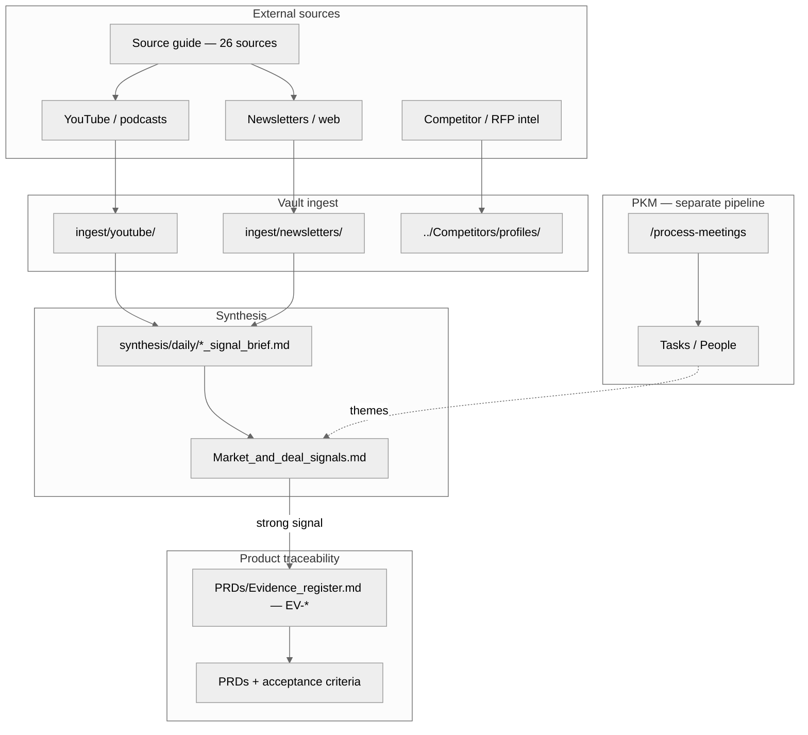

# Market intelligence — architecture

**Related:** [README.md](./README.md) · [WORKFLOW.md](./WORKFLOW.md) · [Market_and_deal_signals.md](../Market_and_deal_signals.md)

---

## End-to-end flow

**Slash commands:** `/intelligence-scanning`, `/daily-intelligence-brief`, `/weekly-market-discovery` (see `.claude/skills/`).

---

## Gaps to be aware of

| Gap | Mitigation |
|-----|------------|
| Newsletters are manual paste | Use RSS → reader → export, or “view in browser” + paste (see [WORKFLOW.md](./WORKFLOW.md)). |
| Phase 2 deal log empty | Add process when CRM buy-in exists. |
| `EV-*` optional | Add rows when a signal informs a spec; cite from PRDs. |
