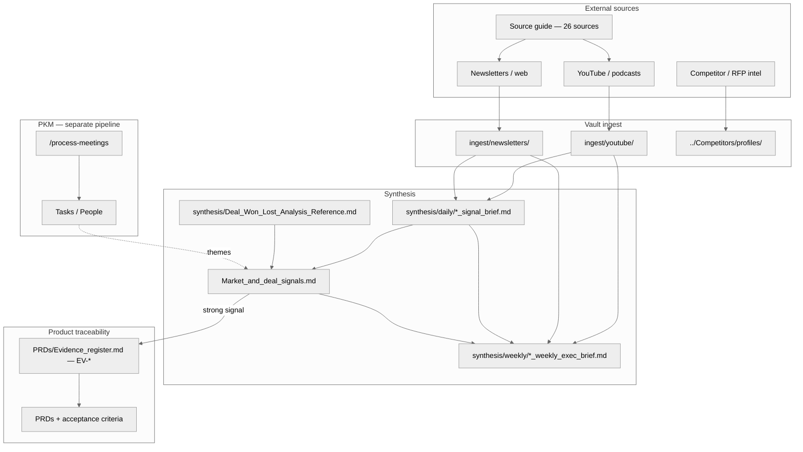

# Market intelligence — architecture

**Related:** [README.md](./README.md) · [ingest/README.md](./ingest/README.md) · [WORKFLOW.md](./WORKFLOW.md) · [Market_and_deal_signals.md](../Market_and_deal_signals.md)

---

## End-to-end flow

**Slash commands:** `/intelligence-scanning`, `/daily-intelligence-brief`, `/weekly-market-discovery`, `/weekly-exec-intel` (see `.claude/skills/`).

---

## Gaps to be aware of

| Gap | Mitigation |
|-----|------------|
| Slugs not discoverable | Use [ingest/README.md](./ingest/README.md) + [sources_manifest.yaml](./sources_manifest.yaml) — folder name = slug. |
| Newsletters often manual paste | Optional: **`fetch_intel_rss.py`** + **`intel_feeds.json`** (see [WORKFLOW.md](./WORKFLOW.md)); else RSS reader → export, or “view in browser” + paste. |
| Phase 2 deal log empty | Add process when CRM buy-in exists. |
| `EV-*` optional | Add rows when a signal informs a spec; cite from PRDs. |
