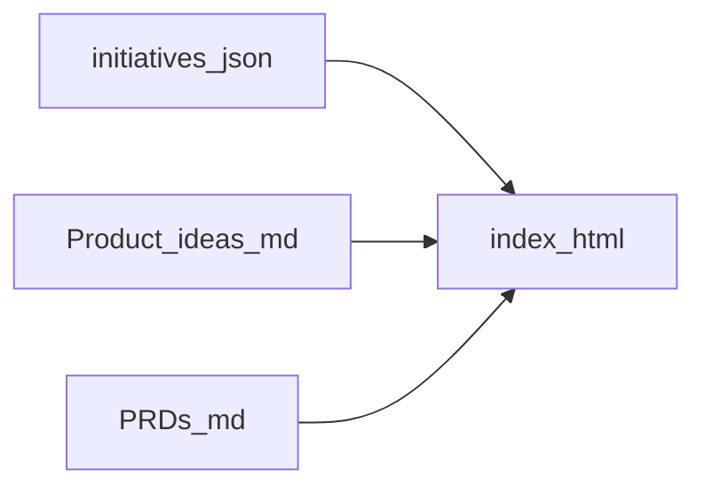

# Product dashboard — Paper v1 visual implementation

**Status:** Ready for Agent Implementation  
**Target:** Local product orchestration dashboard (`Dex_System/product-dashboard/`) served from vault root  
**Design source:** Paper Desktop **Product UI v1** artboards **00–05** (see `Paper_fresh_orchestration_UI.md`)

---

## The Job to Be Done

Product and PM users open the **Orchestration** dashboard in a browser and get a **calm, editorial UI** that matches the approved **Paper** design (Inter + Newsreader, teal accent `#0f766e`, light neutrals), while **all vault-backed data, lane gating, and export behavior** remain unchanged.

**User value:** Visual confidence and parity with design review; no loss of initiative/PRD workflow.

---

## Non-goals

- Redesigning **Executive** table layout beyond shared tokens/chrome (standalone Paper page later).
- Changing **`initiatives.schema.json`**, lane enums, or `build_initiatives_from_prds.py` unless fixing a defect.
- Replacing Markdown/Turndown editors with proprietary rich text.

---

## Observable behaviors (OB)

| ID | Behavior | Observable |
|----|----------|--------------|
| OB-01 | Default view is Orchestration | `panel-orch` active; swimlanes render from `state.data.lanes` and `initiatives`; **Idea** lane shows primary **+ New idea** control |
| OB-02 | Four-tab ticket respects lanes | `allowedTabsForLane()` unchanged; locked tabs show disabled state + lock affordance |
| OB-03 | Vault paths load | With vault-root static server, `fetch` to `06-Resources/...` succeeds for workspace + PRD |
| OB-04 | Markdown round-trip | `#md-wysiwyg` content maps to headings, lists, bold, italic via existing toolbar / execCommand path |
| OB-05 | New initiative flow | Modal labels align with Paper **05**; **Create draft** (primary) and **Cancel**; title required before create |
| OB-06 | Discovery lane | `#discovery-agent-banner` visible in Discovery lane; **Re-run discovery** triggers same refresh path as discovery doc refresh where applicable |

---

## Work packages

### WP-1: Design tokens (Paper MCP + CSS)

**Priority:** P0  
**Files:** [`Dex_System/product-dashboard/product-dashboard.css`](../../../Dex_System/product-dashboard/product-dashboard.css)

**Procedure (agents):**

1. Call MCP `plugin-paper-desktop-paper`: `get_guide({ topic: "paper-mcp-instructions" })` once per session.
2. `get_basic_info` — confirm file name **Product UI v1**, artboards **01–05** (+ **00** reference).
3. Per frame **01–05**, use `get_computed_styles` on representative nodes (top bar, primary button, card, tab active border) and/or `get_jsx` for structure hints.
4. Map to `:root` CSS variables (do not paste raw Paper node IDs in user-facing README — use layer names in comments only).

**Token targets (baseline from design doc):**

- Background: `#f7f6f3`; surfaces: `#ffffff` / `#fafaf9`; text: `#1c1917`; muted: `#57534e` / `#78716c`; border: `#e7e5e4`; accent: `#0f766e`.
- Fonts: **Inter** UI, **Newsreader** display/wordmark.
- Lane column width ~186px; swimlane gap ~10px; card radius ~10px.

---

### WP-2: Orchestration shell (Paper 01)

**Priority:** P0  
**Files:** [`index.html`](../../../Dex_System/product-dashboard/index.html), [`product-dashboard.css`](../../../Dex_System/product-dashboard/product-dashboard.css)

- Header: wordmark + product line (Paper top bar), user area.
- `#orchestration-root`: lane columns without heavy “boxed lane” chrome; white **cards** on warm background.
- **+ New idea** full-width teal button in **Idea** lane (`add-idea-btn` class + JS label).

---

### WP-3: Initiative ticket (Paper 02–04)

**Priority:** P0  
**Files:** [`index.html`](../../../Dex_System/product-dashboard/index.html), [`product-dashboard.css`](../../../Dex_System/product-dashboard/product-dashboard.css)

- `#detail-dlg`: subhead (tier, lane, updated, move lane), tab strip with bottom accent on active tab, disabled opacity on locked tabs.
- Discovery: banner row includes **Re-run discovery** (`#btn-rerun-discovery`).
- Requirements: format bar + `#md-wysiwyg` styling for long-form PRD reading.
- Primary **Save** uses accent teal for consistency with Paper primary actions (optional vs black — implemented as teal).

---

### WP-4: New initiative modal (Paper 05)

**Priority:** P1  
**Files:** [`index.html`](../../../Dex_System/product-dashboard/index.html), JS save handler

- Fields: title, problem, card summary, who, success, constraints (details), **intake source** select, tier, priority.
- Actions: **Create draft** (primary), **Cancel** (secondary).
- Inline validation hint when title empty (no blocking `alert` only — prefer subtle hint).

---

### WP-5: Executive tab

**Priority:** P2  
**Files:** [`product-dashboard.css`](../../../Dex_System/product-dashboard/product-dashboard.css)

- Apply shared variables to `.exec-paper`, table, focus strip; no table column redesign.

---

## DOM ID inventory (do not rename without updating JS)

| Region | IDs |
|--------|-----|
| Shell / panels | `panel-orch`, `panel-exec`, `orchestration-root`, `exec-context-line`, `exec-focus`, `exec-table` |
| Ticket | `detail-dlg`, `dlg-title-input`, `dlg-status-bar`, `dlg-tier-pill`, `dlg-lane-pill`, `dlg-last-updated`, `dlg-move-lane`, `dlg-lane-row`, `tab-brief`, `tab-discovery`, `tab-requirements`, `tab-design`, `ticket-panel-brief`, `ticket-panel-doc`, `ticket-panel-design`, `dlg-desc`, `dlg-workflow`, `dlg-intake`, `discovery-agent-banner`, `btn-rerun-discovery`, `ticket-workspace-hint`, `ticket-req-placeholder`, `ticket-doc-path`, `md-wysiwyg`, `dlg-prd-paths`, `dlg-discovery-row`, `dlg-discovery-path-short`, `dlg-figma`, `dlg-design-artifact`, `dlg-design-revision`, `btn-save-card`, … |
| Add initiative | `add-idea-dlg`, `add-title`, `add-summary`, `add-problem`, `add-target-users`, `add-success`, `add-constraints`, `add-ux`, `add-validation`, `add-dependencies`, `add-tier`, `add-prio`, `add-intake`, `add-idea-save`, `add-idea-close`, `add-cancel`, `add-title-hint` |
| Discovery ticket | `btn-rerun-discovery` (reloads vault doc via `loadActiveTicketDocument`) |
| Discovery dialogs | `discovery-review-dlg`, `disc-title`, `disc-desc`, `discovery-run-dlg`, `discovery-doc-view`, … |

---

## Technical blueprint — Paper MCP checklist

```text
get_guide("paper-mcp-instructions")
get_basic_info
For each artboard 01..05:
  get_screenshot(nodeId) [optional]
  get_computed_styles(nodeIds) on chrome, button, card, tab
  get_jsx / get_tree_summary if layout parity unclear
finish_working_on_nodes()
```

---

## Data flow (unchanged)



---

## Agent-executable validation (VAL)

| ID | Check |
|----|--------|
| VAL-01 | `./start_product_dashboard.sh --open` loads dashboard; console free of errors on first paint |
| VAL-02 | Open card in **idea** / **discovery** / **spec_ready** — tab availability and PRD load match `ORCHESTRATION.md` |
| VAL-03 | Edit fields → **Export JSON** — merged structure still valid vs schema |
| VAL-04 | Side-by-side with Paper **Product UI v1** frames **01–05**: hierarchy and accent usage match |

---

## Work package dependency graph

```text
WP-1 (tokens) → WP-2 (board) → WP-3 (ticket) → WP-4 (modal)
WP-5 (exec) can follow WP-1 in parallel
```

---

## References

- [`Dex_System/product-dashboard/README.md`](../../../Dex_System/product-dashboard/README.md) — run server, export rules  
- [`CONCEPTS.md`](../../../Dex_System/product-dashboard/CONCEPTS.md) — implementation requirements  
- Cursor Paper plugin MCP: `plugin-paper-desktop-paper`
