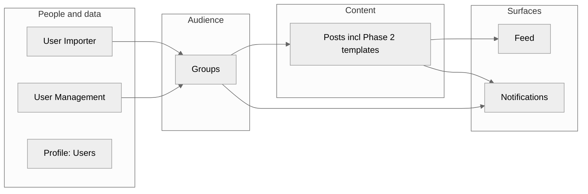

# PRD product map — how the specs fit together

**Purpose:** Single place for **dependencies**, **shared concepts**, and **canonical rules** when individual PRDs overlap. Use this during refinement, sequencing, and QA. Feature PRDs remain the detailed source; this map is the integration layer.

**Last reviewed:** 2026-04-17 (flattened `PRDs/` layout; BDD merged into feature PRDs).

**Hub:** [Requirements.md](./Requirements.md) · **Index:** [README.md](./README.md)

---

## 1. Core content loop (audience → publish → surface)

**Product intent:** **Groups define who a post is for; the feed is where those users see it.** Posts without a resolved audience are incomplete — targeting is not optional for publish ([Posts.md](./Posts.md)). The **system “Everyone”** group ([Groups.md](./Groups.md)) is the exception for broadcast-style sends; prefer saved or once-off groups when the story is not truly company-wide.

| Capability | PRDs involved |
|------------|----------------|
| Keys for query builder / segments | [User_Importer.md](./User_Importer.md) (imported fields) → [Groups.md](./Groups.md) |
| Attach audience + publish | [Groups.md](./Groups.md) ↔ [Posts.md](./Posts.md) |
| Employee sees content | [Feed.md](./Feed.md) (group membership + LIFO) |
| Optional publish alerts | [Posts.md](./Posts.md) toggle → [Notifications.md](./Notifications.md) → [communication_service.md](./communication_service.md) |
| Extended templates (PDF, video, external form link) | [Posts.md](./Posts.md) Phase 2; rendered on [Feed.md](./Feed.md) |

**Derived QA layer:** Feed BDD (display, archive, urgent pin) lives in [Feed.md](./Feed.md#acceptance-criteria-bdd); keep in sync with [Messaging_Ops_Urgent_Alerts.md](./Messaging_Ops_Urgent_Alerts.md). Other features: **`## Acceptance criteria (BDD)`** inside each PRD — see [README.md](./README.md).

---

## 2. Messaging, WhatsApp, and the feed (parallel to posts)

[Messaging_Ops_Urgent_Alerts.md](./Messaging_Ops_Urgent_Alerts.md) combines **Part 1** (ops + urgent + operational messaging) and **Part 2** ([WhatsApp outbound](./Messaging_Ops_Urgent_Alerts.md#whatsapp-channel--outbound-messaging)). It uses the **same audience primitives** as posts ([Groups.md](./Groups.md): Everyone, saved group, directory, new group). **Urgent** alerts add takeover + **pinned block on the feed**; **operational** messages must not pollute the feed as pinned content. Coordinate ordering with [Feed.md](./Feed.md#acceptance-criteria-bdd) (PIN-*, SF-05).

---

## 3. Identity, tenant, and first run

| Layer | PRD |
|--------|-----|
| Tenant creation, QR, identifiers | [Tenant_Management.md](./Tenant_Management.md) |
| SMS/email/push plumbing | [communication_service.md](./communication_service.md) |
| Activation & login UX | [Login_Account_Activation.md](./Login_Account_Activation.md) |
| Branding | [Theming.md](./Theming.md) (owner profile / tenant) |

**Happy path after login:** user lands on **feed** ([Login_Account_Activation.md](./Login_Account_Activation.md), [Feed.md](./Feed.md)).

---

## 4. Canonical rules where PRDs touched the same behaviour

### 4.1 Post visibility, archive, and retention (employee vs admin)

**Canonical for what employees see on the main feed and in search:** [Feed.md](./Feed.md) and its **Acceptance criteria (BDD)** section ([Feed.md#acceptance-criteria-bdd](./Feed.md#acceptance-criteria-bdd)).

| Topic | Rule (Phase 1) | Detailed spec |
|--------|----------------|---------------|
| Time on **employee** main feed | **3 months** from publish unless post is **permanent** | [Feed.md](./Feed.md) § Archiving; Feed AC ARC-* |
| **Employee** search/filter | **No** archived posts | Feed AC ARC-04 |
| **Admin** archive surface | Admins can find/manage posts no longer on main feed | Feed AC ARC-01, ARC-05 |
| Long-term purge | **12 months** after archive (clock as defined in tech/legal); tenant policy may vary | Feed AC ARC-02 |
| Admin **dashboard** statuses (Draft / Published / Archived / Deleted) | Workflow labels in [Posts.md](./Posts.md); **timestamps for “off feed”** follow Feed above | [Posts.md](./Posts.md) |

If legacy drafts used different numbers (**60 days** / **30 days**), **do not implement from those in isolation** — reconcile in backlog against this table.

### 4.2 Notifications vs communication

- **Notification types, drawer, severity, actions:** [Notifications.md](./Notifications.md)
- **Channels (FCM, APNs, HMS, SMS, email) and delivery:** [communication_service.md](./communication_service.md)
- **Post publish** uses product toggles in Posts; **delivery** honours Profile notification switches ([Profile_Users.md](./Profile_Users.md)).

---

## 5. Suggested build order (dependency-aware)

1. **Tenant_Management** → **communication_service** (minimal) → **User_Importer** → **User_Management** / **Profile_Users**
2. **Groups** (needs import keys + directory from importer / user management)
3. **Posts** + **Feed** in tight iteration (publish → see in feed); **Notifications** for publish path
4. **Messaging_Ops_Urgent_Alerts** (groups + communication + feed pin)
5. **Posts Phase 2** (PDF / Video / external form link) after core posts + feed + Cloudflare readiness
6. **Theming** in parallel where tenant login/app shell needs it

---

## 6. Acceptance criteria (QA layer)

Testable **Given / When / Then** rows and edge cases live under **`## Acceptance criteria (BDD)`** inside each feature PRD (no separate `*_acceptance_criteria.md` files). **Index:** [README.md](./README.md).

**Market / competitive signals (optional):** Link discovery rationale to `EV-*` rows in [Market_and_competitive_signals.md](../Market_and_competitive_signals.md).

**Cross-PRD open questions** sit in the owning feature PRD (or here when they affect integration rules only).

---

## 7. Cross-reference maintenance

When changing **feed visibility**, **archive**, **groups audience**, or **pinned urgent** behaviour, update **this map §4** and the linked sections in **Feed** (BDD), **Posts**, **Groups**, and **Messaging** so QA has one story.

**Canonical spec:** Extended post formats (PDF, Video, external form link) are specified in **[Posts.md](./Posts.md)** (Phase 2). Do not maintain a duplicate standalone Post Extensions doc.

---

## 8. Agent-oriented PRD structure (Dex vault)

All **feature PRDs** indexed in [README.md](./README.md) carry the [`/agent-prd`](../../.claude/skills/agent-prd/SKILL.md) binding sections: **Work packages**, **Success scenarios**, **Metrics strategy** (analytics deferred until a stack exists), **Architecture constraints**, **Technical blueprint** (hybrid — product/integration detail now, **Implementation repository paths (TBD)** for code), **Validation protocol** (vault checks + BDD references), and extended YAML frontmatter (`project_mgmt_tool: none`, `analytics_tool: none` unless otherwise stated). Defaults and the canonical file list: [_Retrofit_playbook.md](./_Retrofit_playbook.md). **Pilot reference:** [AI_Assistant_FAQ.md](./AI_Assistant_FAQ.md).
