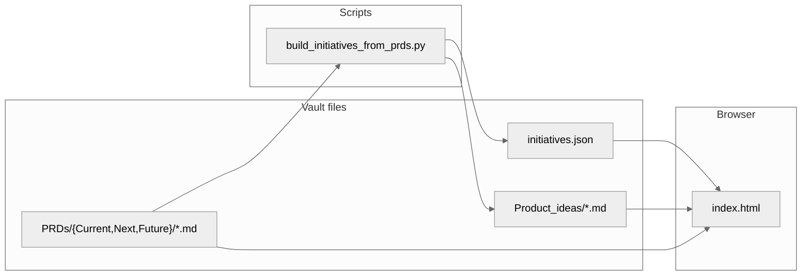

# Product dashboard — core concepts (vault ↔ UI)

## Implementation requirements (unchanged)

- **Landing:** **Orchestration** is the default product entry; **Executive** may still exist in the browser until a **separate Executive page** ships (**Roadmap** same story — future standalone page).  
- **Ticket:** **Brief** | **Discovery** | **Requirements** | **Design** with **lane-based gating** (`allowedTabsForLane`).
- **Requirements tab:** Vault **PRD** (`06-Resources/PRDs/...`), authored with **`/agent-prd`** — first-class spec surface; not a stub.  
- **Documentation editing:** Long-form areas should support **headings**, body text, **bullet lists**, **bold**, *italic*, with **Markdown** as the interchange format on save/export (see **`Paper_fresh_orchestration_UI.md`**).
- **Vault:** `initiatives.json`, `06-Resources/Product_ideas/{id}.md` (discovery), `06-Resources/PRDs/...` (PRD when stage allows), optional **design file URL** / **revision** on export — see **ORCHESTRATION.md**.

## Paper reference (design → code)

**Paper** artboards in **`Paper_fresh_orchestration_UI.md`** describe **Product Orch** only: **01–05** (board + create idea, ticket states **02–04**, **05** new initiative modal tied to **Create idea** on **01**). **Executive portfolio** and **Roadmap** are **out of scope** for that doc — each gets its **own** design later. Artboards are **not** the source of truth for business logic.

To align the **web UI** with a Paper design, use the Cursor Paper plugin’s **design-to-code** skill: **Paper Desktop** running, MCP server **`plugin-paper-desktop-paper`**, tools such as **`get_jsx`**, **`get_computed_styles`**, **`get_tree_summary`** on the selected frame, then map tokens and layout into **`product-dashboard.css`** / **`index.html`** while **preserving** the behaviors above.

**Orchestration** matches Paper **01** (including **Create idea** affordance); **initiative ticket** matches **02–04** (plan: **03** includes **Re-run discovery** when the brief changes; **04** includes **Requirements** as **`/agent-prd`** screen + Markdown editing affordances); **05** pairs with **01**. Four tabs, lane gating, and vault **`fetch()`** paths are unchanged.

If MCP fails, restart Paper Desktop and the agent session ([docs](https://paper.design/docs/mcp)).

## Data flow

- **`build_initiatives_from_prds.py`** (run from `Dex_System/product-dashboard/`) regenerates **`initiatives.json`** and **Product_ideas** stubs from PRDs.
- **`start_product_dashboard.sh`** serves the **vault root** so `fetch()` paths like `06-Resources/Product_ideas/...` resolve.

## Location

**`Dex_System/`** lives at the **vault root** (sibling of `06-Resources/`).
