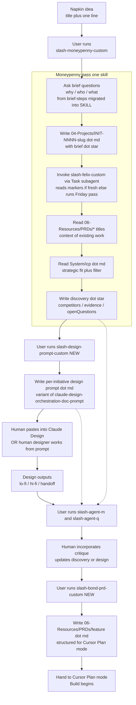

# Skill Pipeline — the live methodology

**Status:** ACTIVE
**Started:** 2026-04-24
**Supersedes:** `plans/PDLC_UI/` (parked 2026-04-24)

**Phase 0 — COMPLETE (2026-04-24):** FROZEN banners on `plans/PDLC_UI/plan.md` + `sprint-backlog.md` + seeds README; git tag `freeze/skills-pipeline-pivot`; **`/gatekeeper-custom`** removed (use **`babysit`** + frozen R16 docs); [`.claude/hooks/session-start.sh`](../../.claude/hooks/session-start.sh) §22 loads `plans/skill-pipeline/README.md` excerpt + full `System/icp.md`; sprint seeds **s3a*, s3b, s4–s8** archived under [`plans/PDLC_UI/seeds/_archived-2026-04-24/`](../PDLC_UI/seeds/_archived-2026-04-24/) with cross-refs updated across plan corpus + skills.

---

## 1. Why this exists

`plans/PDLC_UI/` was building a Kanban-style orchestration UI for product delivery. Post-Sprint 3 the cycle turned expensive — iteration between prose sprint seeds, Loom reviews, and scope drift cost more than the chat+vault workflow it was trying to replicate. The real workflow is **one operator + Dex chat + markdown in the vault**. The UI was scaffolding that didn't earn its keep.

Pivot 2026-04-24: park `pdlc-ui/` entirely. Refine every skill in the orchestration pipeline to 100% across six small sprints. Each sprint = one skill. Each skill ends with a concrete Acceptance checklist and one real dogfood run as proof. If the pipeline lands, revisit a thin UI later. If it doesn't, the UI was never the problem.

## 2. The pipeline in one picture

## 3. Design decisions baked into the pipeline

- **Moneypenny is the entry point.** She captures the idea (creates `04-Projects/INIT-NNNN-<slug>.md`), asks the brief questions in chat, runs the research pass. `brief-steps.ts` content (why / who / what) migrates out of the parked pdlc-ui wizard and into her SKILL.md.
- **Felix is a sub-skill invoked via the Task tool.** He reads markers if fresh (≤7 days); otherwise runs his Friday pass first. Markers live on disk — the cost is already paid.
- **Existing PRDs are context.** Moneypenny reads `06-Resources/PRDs/*.md` titles + one-liners so she knows what's already in the system. Prevents the "verbal duplicate brief" pain.
- **Design is a prompt-generator skill, not a design-runner.** Output is a markdown file the human pastes into Claude Design. A human designer can work from the same file without running any automation.
- **M + Q critique any markdown artefact** — discovery, design prompt, design outputs, PRD. Same skill, different target each invocation.
- **Bond is the PRD author.** Output shape is defined in his SKILL.md so Cursor Plan mode consumes it without re-prompting.

## 4. Agent roster

| Agent | Role | Sprint |
|-------|------|--------|
| **Felix** (`/felix-custom`) | Upstream weekly intel umbrella — reads Market_intelligence / Competitors / Wyzetalk_Clients / ICP; writes markers | **S1** — lock Acceptance checklist |
| **Moneypenny** (`/moneypenny-custom`) | Per-initiative debriefer — captures idea, asks brief questions, reads Felix markers + existing PRDs + ICP, writes `discovery.*` | **S2** — migrate brief questions in |
| **`/design-prompt-custom`** (NEW) | Per-initiative design prompt generator — output is paste-ready `.md` for Claude Design | **S3** — author + dogfood |
| **M** (`/agent-m-cpo-custom`) | CPO critique on any markdown artefact (3 rows) | **S4** — shrink + wire |
| **Q** (`/agent-q-cto-custom`) | CTO critique on any markdown artefact (4 rows) | **S4** — shrink + wire |
| **Bond** (`/bond-prd-custom`) (NEW) | PRD author — consumes brief + discovery + design prompt + critique notes; writes `06-Resources/PRDs/<feature>.md` for Cursor Plan mode | **S5** — author + dogfood |
| **~~Gatekeeper~~** (`/gatekeeper-custom`) | Removed from vault 2026-04-24 | Use **`babysit`** + frozen `plans/PDLC_UI/engineering-guardrails.md` if `pdlc-ui` PRs resume |

## 5. Sprint cadence — 6 sprints, ~3 weeks

Full sprint scope is in the active plan file: [`skill-pipeline-bdd-replan`](../../.cursor/plans/skill-pipeline-bdd-replan_5d961e0d.plan.md) (read via Cursor Plan mode). The `todos` frontmatter there is the authoritative sprint list.

## 6. Per-sprint delivery shape

Every sprint has the same shape — write it once, follow it every time:

1. **SKILL.md updated or authored** — purpose, invocation, inputs, outputs, failure modes.
2. **Acceptance checklist** at the bottom of SKILL.md:
   - [ ] Reads: `<paths>`
   - [ ] Writes: `<paths>`
   - [ ] Gates: `<what blocks the run>`
   - [ ] Failure modes: `<what happens on partial failure / stale input>`
   - [ ] Cost ceiling: `<per-run target>`
3. **One real dogfood run** against one real artefact / initiative / idea.
4. **M + Q critique** on the updated SKILL.md + dogfood output. Must-fixes folded before closing.
5. **Slice log line** in `04-Projects/PDLC_Orchestration_UI.md`.

No Playwright. No Cucumber runner. No `.feature` files this cycle. Optional upgrade path if iteration cost climbs back up later — it is additive.

## 7. Context + cost discipline

- **Session-start hook** loads canonical context once per session: `System/icp.md`, this README (excerpt + pointer), plus the rest of the Dex session preamble. Implemented in Phase 0 as [`.claude/hooks/session-start.sh`](../../.claude/hooks/session-start.sh) (**§22 — Skill pipeline + ICP**). Stops paying tokens to re-read these files on every skill invocation.
- **Skills read targeted paths only** — no glob-the-world patterns. Every SKILL.md's Acceptance checklist lists exact input paths.
- **Intermediate outputs cached on disk.** Felix's markers under `06-Resources/Market_intelligence/synthesis/weekly/` and Moneypenny's `discovery.*` blocks in the initiative markdown are read by downstream skills — they are not re-computed.
- **Sub-skills invoked via the Task tool (subagents).** Moneypenny fans out to Felix in a child context so her main session does not bloat with Felix's raw inputs.
- **Cost ceiling in every Acceptance checklist.** $0.50 per Moneypenny card run, $5 per end-to-end pipeline run (tracked via the existing `skill_run` event shape).

## 8. Success measure — pipeline proven

End of ~3 weeks:
- Fresh idea → PRD in <1 working day wall-clock.
- Pipeline cost <$5 per run.
- <2 human re-prompts across the full pipeline.
- Cursor Plan mode consumes Bond's PRD without structural re-prompting.
- Each skill has SKILL.md + Acceptance checklist + one dogfooded worked example.
- [`lessons-from-skills.md`](./lessons-from-skills.md) seeded with what worked, what didn't, what a UI would need.

## 9. What this pivot preserves vs parks

**Preserved live:**
- [`plans/PDLC_UI/schema-initiative-v0.md`](../PDLC_UI/schema-initiative-v0.md) — still the `brief.*` / `discovery.*` / `spec.*` field contract; Moneypenny + Bond read and write against it.
- [`plans/PDLC_UI/lifecycle-transitions.md`](../PDLC_UI/lifecycle-transitions.md) — still describes the lane progression in concept (idea → discovery → design → spec_ready → develop → uat → deployed), even without the UI that enforces it.
- `System/icp.md` — read by Moneypenny every run.
- All `-custom` skills except Gatekeeper.
- [`plans/Research/moneypenny-strategy.md`](../Research/moneypenny-strategy.md) + [`felix-strategy.md`](../Research/felix-strategy.md).
- `plans/PDLC_UI/claude-design-orchestration-doc-prompt.md` — referenced by the S3 `/design-prompt-custom` skill as the template.

**Parked (frozen reference, not driving current work):**
- `pdlc-ui/` repo — on a freeze branch, no active development.
- `plans/PDLC_UI/plan.md`, `sprint-backlog.md`, `skill-agent-map.md`, `engineering-guardrails.md`, `implementation-standard.md`, `tech-stack.md`, `plan-mode-prelude.md`.
- Detailed sprint seeds **s3a*, s3b, s4–s8** under [`plans/PDLC_UI/seeds/_archived-2026-04-24/`](../PDLC_UI/seeds/_archived-2026-04-24/) · in-place seeds remain: `s0`, `s1`, `s2`, `s3-brief-wizard`, `s9`, `README`, `_superseded/`.

**Deleted:**
- ~~`.claude/skills/gatekeeper-custom/`~~ — **deleted** 2026-04-24 (never pushed on this branch; last committed PR gate was at `moneypenny-custom/SKILL.md` before Phase 0: `git show freeze/skills-pipeline-pivot^:.claude/skills/moneypenny-custom/SKILL.md`).

## 10. Future — when UI comes back (not now)

If S6 exits clean, revisit `pdlc-ui/` as a **thin read-only viewer** over vault markdown, informed by [`lessons-from-skills.md`](./lessons-from-skills.md). No commitment this cycle. If skills don't land end-to-end, the UI wasn't the problem to solve.
