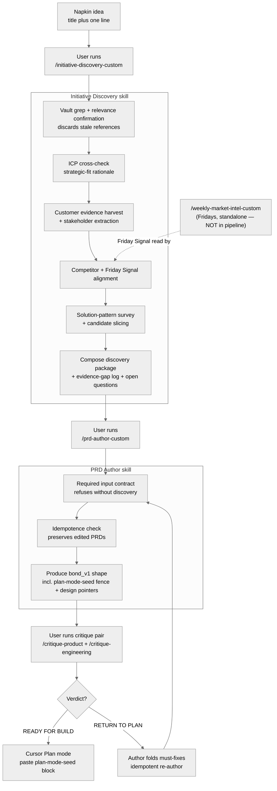
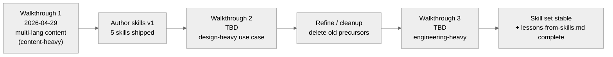

# Skill Pipeline — the live methodology

**Status:** ACTIVE
**Started:** 2026-04-24
**Pivoted:** 2026-04-29 — from layer-by-layer skill build to validate-via-walkthrough; persona-named skills renamed to job-described names.
**Supersedes:** `plans/PDLC_UI/` (parked 2026-04-24)

**Phase 0 — COMPLETE (2026-04-24):** FROZEN banners on `plans/PDLC_UI/plan.md` + `sprint-backlog.md` + seeds README; git tag `freeze/skills-pipeline-pivot`; **`/gatekeeper-custom`** removed; [`.claude/hooks/session-start.sh`](../../.claude/hooks/session-start.sh) §22 loads this README excerpt + full `System/icp.md`.

**Phase 1 — COMPLETE (2026-04-29):** Pipeline shape validated via manual walkthrough (multi-language content translation use case); five renamed skills authored end-to-end; cancelled the original 6-sprint build plan + the tracer-bullet delta plan. See [`sessions/2026-04-29.md`](./sessions/2026-04-29.md) for full session record.

---

## 1. Why this exists

`plans/PDLC_UI/` was building a Kanban-style orchestration UI for product delivery. Post-Sprint 3 the cycle turned expensive — iteration between prose sprint seeds, Loom reviews, and scope drift cost more than the chat+vault workflow it was trying to replicate. The real workflow is **one operator + Dex chat + markdown in the vault**. The UI was scaffolding that didn't earn its keep.

**First pivot (2026-04-24):** park `pdlc-ui/` entirely. Refine every skill in the orchestration pipeline across six small sprints. Each sprint = one skill.

**Second pivot (2026-04-29):** the 6-sprint build plan was about to author 5 skills against unvalidated assumptions. We cancelled it and ran a manual walkthrough (multi-language feed translation) as a test harness. The walkthrough surfaced which behaviours were genuinely load-bearing — including some the original plan had wrong. Result: **5 renamed skills authored in one session**, anchored to a real PRD test artefact ([`Multilingual_Content.md`](../../06-Resources/PRDs/Multilingual_Content.md)), with concrete evidence per skill in [`lessons-from-skills.md`](./lessons-from-skills.md).

## 2. The pipeline in one picture

> **For stakeholders:** presentation-ready briefings ship with this folder. Open in a browser, screenshot for slides, or print to PDF. No engineering fluency assumed. **`pipeline-flow.html` is the high-level hub; the rest go deeper into specific areas or specific skills.**
>
> 1. [`pipeline-flow.html`](./pipeline-flow.html) &mdash; **the high-level view.** The journey, end-to-end, idea → build. Start here. Skill pills are clickable.
> 2. [`running-the-pipeline.html`](./running-the-pipeline.html) &mdash; **operator's manual.** Three paste-ready starter prompts (cold start, continuation, dry-run) + a per-stage checklist of what to type, what to expect back, and what to scan before continuing. Read this if you're about to run the pipeline yourself from Claude Code.
> 3. [`design-in-the-pipeline.html`](./design-in-the-pipeline.html) &mdash; **design deep-dive.** Design&rsquo;s typed role at every stage. Read this if the question of *where design fits* comes up &mdash; especially during the handoff to the Design Manager.
> 4. [`friday-signal-cadence.html`](./friday-signal-cadence.html) &mdash; **market-intel deep-dive.** The weekly cadence that produces the Friday Signal. Read this to understand how outside-in evidence enters the pipeline.
> 5. [`skills/`](./skills/) &mdash; **per-skill deep-dives.** One HTML page per skill in the pipeline: what it does step-by-step, what it reads, what it writes, the load-bearing rule, refusals, and how it pairs with companion skills. Linked from the skill pills in `pipeline-flow.html`.
>    - [`skills/initiative-discovery.html`](./skills/initiative-discovery.html) &mdash; stage 02
>    - [`skills/prd-author.html`](./skills/prd-author.html) &mdash; stage 03
>    - [`skills/critique-product.html`](./skills/critique-product.html) &mdash; stage 04 (product half)
>    - [`skills/critique-engineering.html`](./skills/critique-engineering.html) &mdash; stage 04 (engineering half)

The dotted line from `/weekly-market-intel-custom` is the only cross-pipeline dependency: discovery reads the latest Friday Signal during its alignment phase, but the weekly intel skill is **not** invoked by the pipeline. It runs on its own cadence.

## 3. Design decisions baked into the pipeline

- **Job-described skill names** — every skill name says what it does, not who it impersonates. `/critique-product`, not `/agent-m-cpo`. AI and humans operate the skill without persona knowledge.
- **`-custom` suffix preserved** — Dex convention for `/dex-update` protection. Suffix is plumbing, not persona obscurity.
- **Discovery is the entry point.** Captures the idea, scans the vault with relevance confirmation (no stale references), cross-checks the ICP, harvests customer evidence, surfaces evidence gaps, proposes candidate slices.
- **Confirm-relevance per grep hit is load-bearing.** A stale "future phase" reference in `Scheduled_Content.md` misled discovery for an hour during the walkthrough. Discovery now aggressively prunes stale citations.
- **Evidence-gap detection is mandatory.** When the vault is sparse, the skill explicitly logs what's missing rather than fabricating conviction.
- **PRD is slice-shaped, not work-package-shaped.** `/prd-author-custom` produces the `bond_v1` shape: walking-skeleton slice 1, thickening slices, plan-mode-seed fence that maps 1:1 to Cursor Plan mode. Coexists with the older `/agent-prd` (different downstream consumer).
- **PRD is idempotent.** Author edits are signal. The skill diffs and asks before overwriting; never silently clobbers.
- **Design pointers folded into PRD.** No separate `/design-prompt-custom` skill — the multi-language walkthrough produced no incremental value from a separate design step. **Re-validate on a design-heavy walkthrough**; reinstate if proven wrong.
- **Critique skills run as a pair.** Product first (locks the why), engineering second (sharpens the how). Either skill alone is a partial pass.
- **`eng-alt` is mandatory.** Engineering critique always produces ≥1 cheaper / sturdier alternative shape — even if the answer is "current shape is the simplest path."
- **Weekly market intel is standalone.** Runs Fridays. Pipeline reads its output but never invokes it.

## 4. Skill roster (current — 2026-04-29)

| Skill | Replaces | Role | Status |
|-------|----------|------|--------|
| [`/weekly-market-intel-custom`](../../.claude/skills/weekly-market-intel-custom/SKILL.md) | `/felix-custom` | Weekly outside-in research umbrella → writes Friday Signal brief for Steerco | ACTIVE |
| [`/initiative-discovery-custom`](../../.claude/skills/initiative-discovery-custom/SKILL.md) | `/moneypenny-custom` | Per-initiative discovery research → produces structured discovery package | ACTIVE |
| [`/prd-author-custom`](../../.claude/skills/prd-author-custom/SKILL.md) | (new — coexists with `/agent-prd`) | Slice-shaped PRD author → produces `bond_v1` PRD with plan-mode-seed | ACTIVE |
| [`/critique-product-custom`](../../.claude/skills/critique-product-custom/SKILL.md) | `/agent-m-cpo-custom` | Product / outcome / UX-risk critique on plan / PRD / seed | ACTIVE |
| [`/critique-engineering-custom`](../../.claude/skills/critique-engineering-custom/SKILL.md) | `/agent-q-cto-custom` | Engineering / feasibility / build-shape critique on plan / PRD / seed | ACTIVE |
| ~~`/design-prompt-custom`~~ | (never authored) | Was: per-initiative design prompt generator | **KILLED** 2026-04-29 — design pointers folded into `/prd-author-custom`. Re-validate on design-heavy walkthrough. |
| ~~`/gatekeeper-custom`~~ | (deleted 2026-04-24) | Was: post-merge engineering gate | DELETED — use Cursor `babysit` + frozen `engineering-guardrails.md` if `pdlc-ui` PRs resume. |

The four persona-named precursors (felix-custom, moneypenny-custom, agent-m-cpo-custom, agent-q-cto-custom) were **deleted 2026-04-29** after walkthrough 2 validated their renamed replacements end-to-end. Provenance is preserved in each new skill's footer (`*Replaces <old-name>...*`) and in [lessons-from-skills.md](./lessons-from-skills.md).

## 5. Validation cadence (replaces the old 6-sprint build cadence)

The original plan was: 6 sprints, each sprint = 1 skill, build-then-test. Cancelled 2026-04-29.

The current cadence is: **walkthrough-validate-then-author**. Pick a real use case, run it through the pipeline by hand (or with the current skill set), capture which behaviours earned their keep, then author / refine the skills against that evidence.

Walkthroughs are the validation harness. Skills change only on walkthrough evidence. No more "build the skill first, hope it works."

## 6. Per-walkthrough delivery shape

Every walkthrough has the same shape:

1. **Pick a real initiative** — not a toy. Should stretch at least one dimension (content-heavy / design-heavy / engineering-heavy / cross-functional).
2. **Run the pipeline end-to-end** — discovery → PRD → critique. Use the current skill set.
3. **Capture evidence in [`lessons-from-skills.md`](./lessons-from-skills.md)** — what worked, what didn't, which skill behaviour earned its keep, which didn't.
4. **Refine skills against evidence** — only the behaviours the walkthrough validated. Resist scope creep.
5. **Session summary in [`sessions/<date>.md`](./sessions/)** — narrative + decisions + artefacts produced.
6. **PR / commit** — single focused commit per walkthrough's skill changes.

## 7. Context + cost discipline

- **Session-start hook** loads canonical context once per session: `System/icp.md`, this README (excerpt + pointer), plus the rest of the Dex session preamble. Implemented in Phase 0 as [`.claude/hooks/session-start.sh`](../../.claude/hooks/session-start.sh) (§22 — Skill pipeline + ICP).
- **Skills read targeted paths only** — no glob-the-world patterns. Every SKILL.md's Acceptance checklist (when present) lists exact input paths.
- **Intermediate outputs cached on disk.** The Friday Signal under `06-Resources/Market_intelligence/synthesis/weekly/` and discovery packages under `06-Resources/Product_ideas/<feature>_discovery.md` are read by downstream skills — they are not re-computed.
- **Sub-skills invoked via the Task tool (subagents)** when spawning makes sense — `/initiative-discovery-custom` may fan out to read multiple corpora in child contexts.
- **Cost discipline tracked qualitatively** for now — the old `skill_run` event scaffolding (atomic writes, cost-ceiling enforcement) was decoupled from this pipeline when pdlc-ui parked. If costs become a problem, instrument then.

## 8. Success measure — pipeline proven

**Phase 1 (closed 2026-04-29):** ✅
- Fresh idea → PRD authored manually (multi-language, ~3.5 hrs end-to-end including critique).
- Five skills authored against real evidence; SKILL.md + refusal lists per skill.
- One real PRD test artefact at [`Multilingual_Content.md`](../../06-Resources/PRDs/Multilingual_Content.md) (currently RETURN TO PLAN — folding M+Q must-fixes is post-MVP for the pipeline itself; the PRD's existence is the proof).
- [`lessons-from-skills.md`](./lessons-from-skills.md) seeded with concrete evidence on five skills + the killed design-prompt step.

**Phase 2 (next walkthrough — design-heavy):** pending
- Run the current skill set on a design-heavy initiative.
- Validate that design-prompt staying killed is correct, OR resurrect it with sharper scope.
- Refine skills against any new evidence.
- Cleanup: delete the four legacy `*-custom` precursors after this proof point.

**Phase 3 (third walkthrough — engineering-heavy):** pending
- Stretch the engineering-critique skill on a runtime-plan artefact (vs the feature-PRD lens used in walkthrough 1).
- Validate the dual-lens framing in `/critique-engineering-custom`.

**Long-run (when skill set is stable):**
- Fresh idea → PRD in <1 working day wall-clock.
- <2 human re-prompts across the full pipeline.
- Cursor Plan mode consumes the PRD's plan-mode-seed without structural re-prompting.
- [`lessons-from-skills.md`](./lessons-from-skills.md) populated end-to-end.

## 9. What this pivot preserves vs parks

**Preserved live:**
- `System/icp.md` — read by `/initiative-discovery-custom` every run. Authored 2026-04-29.
- All five renamed `*-custom` skills.
- [`plans/Research/felix-strategy.md`](../Research/felix-strategy.md), [`plans/Research/moneypenny-strategy.md`](../Research/moneypenny-strategy.md) — operating docs (filenames retained for traceability; content may need a rename pass).

**Parked (frozen reference):**
- `pdlc-ui/` repo — on a freeze branch.
- `plans/PDLC_UI/plan.md`, `sprint-backlog.md`, `skill-agent-map.md`, `engineering-guardrails.md`, `implementation-standard.md`, `tech-stack.md`, `plan-mode-prelude.md`.
- Detailed sprint seeds **s3a*, s3b, s4–s8** under [`plans/PDLC_UI/seeds/_archived-2026-04-24/`](../PDLC_UI/seeds/_archived-2026-04-24/).
- Cancelled plan files: [`skill-pipeline-bdd-replan_5d961e0d.plan.md`](../../.cursor/plans/skill-pipeline-bdd-replan_5d961e0d.plan.md), [`tracer-bullet-prd-shape_11632852.plan.md`](../../.cursor/plans/tracer-bullet-prd-shape_11632852.plan.md). Status: `paused-2026-04-29`. Preserved for reference, not driving current work.

**Already deleted:**
- `.claude/skills/agent-m-cpo-custom/` — deleted 2026-04-29; replaced by `/critique-product-custom`.
- `.claude/skills/agent-q-cto-custom/` — deleted 2026-04-29; replaced by `/critique-engineering-custom`.
- `.claude/skills/moneypenny-custom/` — deleted 2026-04-29; replaced by `/initiative-discovery-custom`.
- `.claude/skills/felix-custom/` — deleted 2026-04-29; replaced by `/weekly-market-intel-custom`.
- `.claude/skills/gatekeeper-custom/` — deleted 2026-04-24.

## 10. Future — when UI comes back (not now)

If walkthroughs 2 + 3 land clean, revisit `pdlc-ui/` as a **thin read-only viewer** over vault markdown, informed by [`lessons-from-skills.md`](./lessons-from-skills.md). No commitment this cycle. If skills don't land end-to-end across multiple use cases, the UI wasn't the problem to solve.
